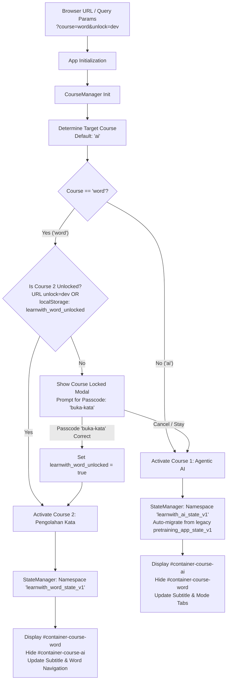

# Phase 9: Multi-Course Architecture & Course Gate Protection - Research

**Researched:** 2026-09-07
**Domain:** Client-side Multi-Course SPA Architecture, State Isolation, URL-based Course Routing & Developer Gate Access Control
**Confidence:** HIGH

<user_constraints>
## User Constraints (from CONTEXT.md)

No user constraints - all decisions at the agent's discretion.
(Proceeded directly from user prompt to plan using research and requirements).

### Scope Directives from REQUIREMENTS.md:
- **GATEWAY-01**: Existing Course 1 (`Hands-on Agentic AI`) remains the default public course without breaking URL endpoints, bookmarks, or localStorage keys.
- **GATEWAY-02**: Course 2 (`Pengolahan Kata Tingkat Lanjut`) is protected by a developer/instructor gate with passcode verification (`buka-kata`) or URL parameter (`?course=word&unlock=dev`).
- **GATEWAY-03**: State storage in `localStorage` is namespaced by course (e.g., `learnwith_ai_*` vs `learnwith_word_*`) to guarantee zero interference between different workshops.
</user_constraints>

<architectural_responsibility_map>
## Architectural Responsibility Map

Single-tier client-side static web application (HTML5, Vanilla ES6+ JavaScript, CSS Custom Properties). All state, routing, and access control execute directly in the browser runtime with zero backend/database dependencies.

| Capability | Primary Tier | Secondary Tier | Rationale |
|------------|-------------|----------------|-----------|
| Course Routing & URL Parameter Sync | Client Browser (URL/History API) | — | SPA without page reloads; responds to `?course=ai` vs `?course=word` |
| Namespaced State Isolation | Client `localStorage` via `StateManager` | In-Memory Object | Ensures state for Course 1 (`learnwith_ai_*`) never conflicts with Course 2 (`learnwith_word_*`) |
| Legacy State Migration Layer | Client `StateManager` Migration Hook | — | Seamlessly copies or reads legacy `pretraining_app_state_v1` without wiping existing user progress |
| Course Protection & Passcode Gate | Client DOM Modal & Auth Guard | `localStorage` (`learnwith_word_unlocked`) | Prevents public participants from accidentally entering Course 2 until unlocked via passcode `buka-kata` or URL `?course=word&unlock=dev` |
| Course Switcher UI Component | Client Header & Sidebar DOM | — | Accessible dropdown or segmented switcher in header and mobile drawer |
</architectural_responsibility_map>

<research_summary>
## Summary

Phase 9 establishes the multi-course architectural foundation for `learnwith`. Currently, the application is tailored to a single course (Hands-on Agentic AI) with two modes (`pretraining` and `live-class`) stored in a single `localStorage` key (`pretraining_app_state_v1`). To host Course 2 (*Pengolahan Kata Tingkat Lanjut*) and future courses, the application needs:
1. **Multi-Course State Namespacing & Migration**: A robust key prefixing pattern (`learnwith_ai_*` and `learnwith_word_*`) where `StateManager` manages the active course context. For existing users, if `learnwith_ai_state_v1` does not exist but `pretraining_app_state_v1` does, an automated one-time non-destructive migration copies the state, guaranteeing 100% backward compatibility for public participants.
2. **Course Gate Access Control**: Course 1 remains publicly accessible by default. Course 2 is gated behind an instructor/developer guard. Users attempting to access Course 2 must unlock it via either URL query parameter (`?course=word&unlock=dev` or `?unlock=word`) or by entering the passcode `buka-kata` in an interactive modal. Once unlocked, the state `learnwith_word_unlocked = 'true'` is persisted in `localStorage`.
3. **Course Switcher Navigation & Shell**: A unified Course Switcher component in the top header and sidebar navigation drawer allowing instant switching between "Hands-on Agentic AI" and "Pengolahan Kata Tingkat Lanjut (ASN)", dynamically rendering course metadata, updating document title, and toggling course root containers (`#container-course-ai` vs `#container-course-word`).

**Primary recommendation:** Modularize `StateManager` to accept an active `courseId` ('ai' | 'word') while keeping the public interface backwards-compatible, provide a dedicated `CourseManager` controller for routing and unlock verification, and wrap existing Course 1 DOM inside `#container-course-ai` so Course 2 can mount cleanly inside `#container-course-word` in Phase 10.
</research_summary>

<standard_stack>
## Standard Stack

### Core
| Library / Technology | Version | Purpose | Why Standard |
|----------------------|---------|---------|--------------|
| Vanilla JavaScript (ES6+) | Modern ECMAScript | State management, routing, events | Zero build step required; runs instantly in any browser and headless runner |
| Web Storage API (`localStorage`) | Standard Web API | Client-side persistence | Synchronous key-value storage across sessions |
| History API / `URLSearchParams` | Standard Web API | Client-side course routing & deep linking | Allows sharing links (`?course=word&unlock=dev`) without page reload |
| CSS Custom Properties | CSS3 | Dynamic theme & branding per course | Clean variable scoping for course themes if needed |

### Supporting
| Component / Utility | Location | Purpose | When to Use |
|---------------------|----------|---------|-------------|
| `StateManager` | `assets/js/state.js` | Multi-course reactive state container | Manages checklists, checkpoints, participant info per course namespace |
| `CourseManager` | `assets/js/app.js` or `assets/js/course.js` | Course switching, gate protection, and DOM visibility | Handles course transitions, gate dialogs, and URL parameter sync |
| `SearchEngine` | `assets/js/search.js` | Scoped search indexer | Re-indexes active course DOM elements when course switches |
</standard_stack>

<architecture_patterns>
## Architecture Patterns

### System Architecture Diagram



### Pattern 1: Safe Migration & Namespace Isolation
```javascript
const COURSE_NAMESPACES = {
  ai: {
    storageKey: 'learnwith_ai_state_v1',
    legacyKey: 'pretraining_app_state_v1',
    title: 'Hands-on Agentic AI',
    subtitle: 'Hands-on Agentic AI • Pra-Training'
  },
  word: {
    storageKey: 'learnwith_word_state_v1',
    unlockKey: 'learnwith_word_unlocked',
    title: 'Pengolahan Kata Tingkat Lanjut',
    subtitle: 'Pengolahan Kata Tingkat Lanjut • Modul ASN'
  }
};
```

### Pattern 2: Course Protection & Unlock Guard
```javascript
const WORD_PASSCODES = ['buka-kata', 'kata-sandi-asn'];

function isWordCourseUnlocked() {
  if (typeof window !== 'undefined' && window.location && window.location.search) {
    const params = new URLSearchParams(window.location.search);
    const unlockVal = (params.get('unlock') || '').toLowerCase();
    if (unlockVal === 'dev' || unlockVal === 'word' || unlockVal === 'instructor') {
      try { localStorage.setItem('learnwith_word_unlocked', 'true'); } catch (e) {}
      return true;
    }
  }
  try {
    return localStorage.getItem('learnwith_word_unlocked') === 'true';
  } catch (e) {
    return false;
  }
}
```
</architecture_patterns>

<dont_hand_roll>
## Don't Hand-Roll

| Problem | Don't Build | Use Instead | Why |
|---------|-------------|-------------|-----|
| URL Query parsing | Custom regex query string parsers | Standard `URLSearchParams(window.location.search)` | Handles encoding, empty values, multiple keys robustly |
| Modal trapping & backdrop | Complex manual window event listeners | Standard modal backdrop classes `.modal-backdrop` & `.open` | Consistency with existing `#modal-liveclass-locked` and `#modal-reset-confirm` |
| Deep State Cloning | Custom recursive object traversal | `JSON.parse(JSON.stringify(state))` | Fast, reliable for plain JSON data structures |
</dont_hand_roll>

<common_pitfalls>
## Common Pitfalls

### Pitfall 1: URL query state desynchronization
**What goes wrong:** User switches course via dropdown, but URL still shows `?course=ai` or doesn't update, making reload or bookmark return to the wrong course.
**Why it happens:** Failing to update browser history state upon course change.
**How to avoid:** Use `history.replaceState` or `history.pushState` to keep `?course={courseId}` in sync without reloading.

### Pitfall 2: Reset State obliterating all courses
**What goes wrong:** Participant in Course 1 clicks "Reset Semua Progres" and inadvertently wipes their Course 2 progress, or vice-versa.
**Why it happens:** Resetting `localStorage.clear()` instead of scoped course state.
**How to avoid:** Ensure `resetState()` only clears the state object and `localStorage` key belonging to the currently active course.

### Pitfall 3: Search index mixing both courses
**What goes wrong:** Participant in Course 1 searches for "Mail Merge" and gets results for hidden Course 2 sections.
**Why it happens:** Search index scans hidden DOM elements across inactive courses.
**How to avoid:** Update `SearchEngine.buildIndex()` to only index elements inside the currently active course container.
</common_pitfalls>

<code_examples>
## Code Examples

### URL-Aware Course Routing
```javascript
function getInitialCourse() {
  if (typeof window !== 'undefined' && window.location && window.location.search) {
    const params = new URLSearchParams(window.location.search);
    const courseParam = (params.get('course') || '').toLowerCase();
    if (courseParam === 'word' || courseParam === 'kata') {
      return 'word';
    }
  }
  try {
    const savedCourse = localStorage.getItem('learnwith_active_course');
    if (savedCourse === 'word') return 'word';
  } catch (e) {}
  return 'ai';
}
```
</code_examples>

<validation_architecture>
## Validation Architecture

### Automated Unit Testing Suite
- Create `tests/multi-course.test.js` validating:
  1. Default course initial load ('ai')
  2. Namespace isolation (`learnwith_ai_state_v1` vs `learnwith_word_state_v1`)
  3. Non-destructive legacy state migration (`pretraining_app_state_v1` -> `learnwith_ai_state_v1`)
  4. Course 2 lock detection (locked by default)
  5. URL parameter unlock (`?course=word&unlock=dev` sets unlocked)
  6. Passcode unlock (`buka-kata` unlocks Course 2)
  7. Course switching event emission and DOM container visibility
  8. Course 1 zero regression (all existing 153 assertions in `mode-switcher`, `live-class-modules`, etc., continue passing)

### Execution Command:
`node tests/multi-course.test.js`
</validation_architecture>

<sources>
## Sources
### Primary (HIGH confidence)
- Codebase inspection: `assets/js/state.js`, `assets/js/app.js`, `assets/js/search.js`, `index.html`
- Test suite verification: `tests/mode-switcher.test.js`, `tests/live-class-modules.test.js`
- Project specifications: `REQUIREMENTS.md` (GATEWAY-01, GATEWAY-02, GATEWAY-03)
</sources>

<metadata>
**Research date:** 2026-09-07
**Valid until:** 2026-10-07
</metadata>
