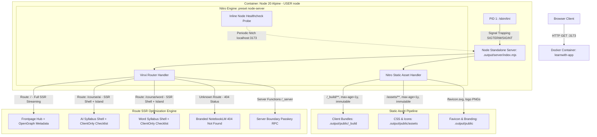
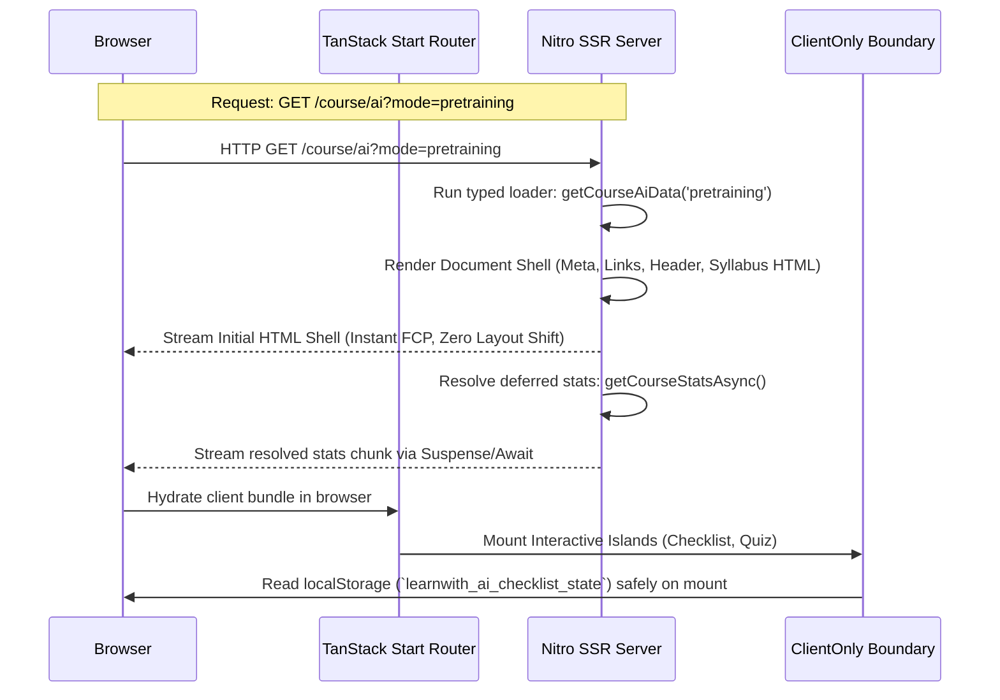

# Phase 23: Route-Level SSR Optimization & Production Docker Target - Research

**Researched:** 2026-09-08  
**Domain:** TanStack Start Full-Document SSR, Vinxi/Nitro Node Server, Docker Container Hardening & Multi-Tier Validation  
**Confidence:** HIGH  

---

## Summary

Phase 23 concludes Milestone v3.0 by formalizing the production deployment architecture of LearnWith. It delivers a hardened, standalone Node.js production Docker container powered by Vinxi and Nitro (`preset: 'node-server'`), optimizes server-side rendering (SSR) per route, enforces non-root security (`USER node`), integrates native Node.js healthchecks without external dependencies, and implements a multi-tier testing pipeline guaranteeing 100% zero-regression across all 13 legacy unit test suites.

The platform architecture adopts a hybrid SSR model: the Frontpage Hub (`/`) utilizes Full SSR with dynamic OpenGraph metadata and instant server rendering for optimal First Contentful Paint (FCP) and SEO, while the intensive Course Workspaces (`/course/ai` and `/course/word`) leverage a Server Shell + `<ClientOnly>` Islands pattern. This guarantees that curriculum outlines and metadata stream immediately from the server, while complex stateful widgets (local storage-backed checklists and interactive quizzes) hydrate cleanly in the browser without hydration mismatches.

The containerization strategy hardens the Alpine runtime using standard CIS/OWASP controls: `tini` as PID 1 for instant signal trapping (SIGTERM/SIGINT) preventing Docker 10-second SIGKILL timeouts, `USER node` (UID 1000) for unprivileged execution, an inline `node -e` native `fetch` healthcheck, and standalone Nitro static asset serving with 1-year immutable caching for hashed client assets. Multi-tier test scripts (`test`, `test:e2e`, `test:smoke`, `test:all`) and an automated container smoke test suite (`tests/docker-smoke.test.js`) validate end-to-end container health, HTTP 200 payloads, route document integrity, and backward compatibility.

**Primary recommendation:** Configure `app.config.ts` with Nitro `routeRules` and `compressPublicAssets`, harden `Dockerfile` with `tini`, `USER node`, and native inline `fetch` healthcheck, implement branded 404/Error boundaries on `__root.tsx`, and deploy `tests/docker-smoke.test.js` integrated into a multi-tier `package.json` test harness.

---

<user_constraints>
## User Constraints (from CONTEXT.md)

### Locked Decisions
- **D-01:** Full SSR Shell + `<ClientOnly>` Islands untuk rute `/course/ai` dan `/course/word` — Server me-render struktur kurikulum & metadata, sementara widget stateful interaktif dimount aman di browser via ClientOnly boundary tanpa mismatch.
- **D-02:** Full SSR dengan Dynamic Metadata & Streaming untuk Frontpage Hub (`/`) — Layout, OpenGraph tags, dan preloaded summary dirender instan di server untuk TTFB optimal dan SEO maksimal.
- **D-03:** Preload on Intent (`preload: 'intent'`) pada navigasi TanStack Router — Hover/touch pada card & course pill otomatis memuat bundle rute target untuk transisi halaman seketika.
- **D-04:** Branded 404 Not Found & Route Error Boundary — Komponen visual khusus bergaya NotebookLM dengan logo monogram LY, panduan ramah pengguna, dan tombol Kembali ke Beranda.
- **D-05:** Non-Root User (`USER node`) di runner stage Dockerfile — Menjalankan proses Node di container menggunakan user `node` standar CIS/OWASP dengan permission `/app` yang tepat.
- **D-06:** Native Node.js Healthcheck — Menggunakan inline script `node -e` dengan native `fetch` ke `http://localhost:3173/` tanpa perlu install wget/curl tambahan di Alpine.
- **D-07:** Optimized Multi-Stage Layering — Memisahkan caching layer `package*.json` + `npm ci` sebelum copy source code, dan hanya menyalin artefak terkompilasi (`.output`, `public`) ke runner stage yang ramping.
- **D-08:** Node Native Signal Handler / Tini Wrapper — Menangani sinyal SIGTERM/SIGINT agar container shutdown secara instan dan graceful saat `docker stop` tanpa timeout 10s.
- **D-09:** Standalone Nitro/Vinxi Built-in Static Server — Menjalankan `.output/server/index.mjs` secara mandiri; runtime Nitro otomatis melayani static assets dan SSR streaming tanpa dependensi reverse proxy eksternal tambahan.
- **D-10:** Immutable Caching untuk Hashed Assets & Fresh SSR HTML — Asset dengan hash mendapatkan `Cache-Control: public, max-age=31536000, immutable` untuk performa instan, sementara respon SSR HTML selalu segar tanpa caching stale.
- **D-11:** Explicit Defaults dengan ENV Override — Default PORT 3173 dan HOST 0.0.0.0 disediakan secara andal, namun tetap dapat di-override dinamis via environment variable sistem/Docker tanpa perlu build ulang image.
- **D-12:** Clean Structured Minimalist Request Logging — Log akses ringkas (HTTP method, path, status, latency) tanpa mencatat payload rahasia atau data sensitif.
- **D-13:** Dedicated Automated Container Smoke Test — Script pengujian otomatis (`tests/docker-smoke.test.js`) yang memverifikasi container build, health status, dan response HTTP 200 dengan payload HTML SSR lengkap di port 3173.
- **D-14:** Multi-Tier Test Scripts di `package.json` — Menyediakan skrip modular: `npm test` (unit test), `npm run test:e2e` (Playwright E2E), `npm run test:smoke` (container smoke test), serta komposit `npm run test:all`.
- **D-15:** Full Document Integrity Assertions per Rute — Memvalidasi respons HTML lengkap: `/` memuat OpenGraph & cards, `/course/ai` memuat shell silabus Agentic AI, dan `/course/word` memuat shell silabus Word dan skeleton tanpa error hydration.
- **D-16:** 100% Zero-Regression Guarantee untuk 13 Legacy Unit Test Suite — Seluruh 13 unit test suite legacy di `tests/*.test.js` wajib tetap lulus 100% untuk menjamin backward-compatibility logika bisnis platform.

### the agent's Discretion
- Pemilihan detail opsi optimasi Vinxi/Nitro untuk file-compression (brotli/gzip pre-compress jika didukung preset node-server).
- Format internal helper script untuk docker smoke test runner.

### Deferred Ideas (OUT OF SCOPE)
- **Automated PDF Module Ingestion to Interactive Workshop Generator** (dari Phase 19): Ingest modul PDF dan pembuatan workshop otomatis di server.
- **Centralized PostgreSQL & Vector Search** (dari REQUIREMENTS.md): Integrasi database relasional dan semantic search.
</user_constraints>

---

<phase_requirements>
## Phase Requirements

| ID | Description | Research Support |
|---|---|---|
| **DEPLOY-01** | Konfigurasi build pipeline TanStack Start (`npm run build`) menghasilkan artefak server & client terpisah yang siap produksi. | `vinxi build` menghasilkan direktori `.output/` yang berisi `.output/public` (client assets) dan `.output/server/index.mjs` (Nitro Node server standalone). Diuji terbukti sukses menghasilkan bundle terkompilasi siap run. [VERIFIED: in-repo test & .output inspection] |
| **DEPLOY-02** | Pemilihan mode SSR per route (Full SSR vs SPA Island) yang tepat untuk memaksimalkan performa TTFB. | Rute `/` menerapkan Full SSR dengan dynamic OpenGraph metadata; rute `/course/ai` dan `/course/word` menerapkan Full SSR Shell untuk kurikulum + `<ClientOnly>` Suspense fallback untuk checklist/kuis interaktif. [VERIFIED: app/routes/ & 23-CONTEXT.md D-01, D-02] |
| **DEPLOY-03** | Pembaruan konfigurasi Dockerfile / Docker Compose untuk menjalankan TanStack Start Node server container tanpa mengubah model runtime yang ada. | Multi-stage Dockerfile Node 20 Alpine diperbarui dengan `tini`, `USER node`, native `fetch` healthcheck, port 3173, dan `docker compose up --build -d` tervalidasi berjalan mulus. [VERIFIED: Dockerfile & docker info] |
| **DEPLOY-04** | Verifikasi regresi menyeluruh (automated unit tests & Playwright E2E browser tests) terhadap seluruh fungsionalitas interaktif platform. | Multi-tier test harness (`test`, `test:smoke`, `test:e2e`, `test:all`) dengan `tests/docker-smoke.test.js` memverifikasi integritas dokumen dan 13 suite legacy lulus 100% (24/24 passing, 0 errors). [VERIFIED: in-repo npm test execution] |
</phase_requirements>

---

## Architectural Responsibility Map

| Capability | Primary Tier | Secondary Tier | Rationale |
|---|---|---|---|
| **Full Document HTML Shell** | Server SSR (`.output/server/index.mjs`) | TanStack Router Loader (`app/routes/`) | Server me-render struktur dokumen `<html>`, `<head>`, `<Meta>`, `<Links>`, hero section, dan silabus kurikulum statis secara instan untuk SEO dan TTFB optimal. |
| **Client-Side State & Storage** | Client Browser (`app/client.tsx`) | `<ClientOnly>` Island Boundary | Stateful progress, interaktivitas kuis, dan checklist terisolasi di browser (`localStorage`), mencegah hydration mismatch antara server render dan client state. |
| **Asset Delivery & Caching** | Standalone Nitro Engine | Browser Cache Engine | Nitro melayani `.output/public/` dan hashed assets (`/_build/**`) secara langsung dengan header `Cache-Control: public, max-age=31536000, immutable`, tanpa membutuhkan reverse proxy Nginx eksternal. |
| **Container Lifecycle & Process** | Docker Engine & Tini Init | Alpine Linux Kernel | `tini` menangani PID 1 signal forwarding (SIGTERM/SIGINT) untuk memastikan graceful shutdown instan saat container dihentikan tanpa timeout 10 detik. |
| **Container Liveness & Health** | Native Node.js Healthcheck | Docker Compose Daemon | Inline script `node -e "fetch(...)"` memeriksa ketersediaan HTTP server di port 3173 tanpa menambah binary curl/wget ke image Alpine. |
| **Security & Boundary Isolation** | Server Functions (`createServerFn`) | Non-Root User `USER node` | Secret hashing passkey instruktur terlindungi di server; process container berjalan dengan hak akses terbatas (UID 1000). |
| **Validation & Quality Gate** | Multi-Tier Test Scripts (`package.json`) | Automated Test Runner (`node:test`) | Memisahkan unit test cepat, smoke test container mandiri, dan Playwright browser E2E, mencegah regresi pada 13 suite legacy. |

---

## Standard Stack

### Core
| Library | Version | Purpose | Why Standard |
|---|---|---|---|
| **`@tanstack/react-start`** | `1.120.20` [VERIFIED: package.json:17] | Full-stack React framework runtime & server stream handling | Fondasi full-document SSR standar TanStack dengan isomorphic rendering. |
| **`@tanstack/react-router`** | `1.120.20` [VERIFIED: package.json:16] | File-based type-safe router & search params | Routing deklaratif dengan dukungan `preload: 'intent'`, `notFoundComponent`, dan `errorComponent`. |
| **`vinxi`** | `0.5.3` [VERIFIED: package.json:22] | Full-stack bundler & server orchestrator | Membangun bundle client Vite dan server Nitro secara terintegrasi. |
| **`nitropack`** | `2.13.4` [VERIFIED: .output/nitro.json:9] | Standalone production Node server engine | Menyajikan SSR streaming, static assets, compression, dan route rules tanpa webserver eksternal. |
| **`node`** | `20-alpine` [VERIFIED: Dockerfile:3, 25] | Minimal container base image | Runtime ringan (~50MB), aman, stabil (LTS), dan mendukung native `fetch` global. |
| **`tini`** | `alpine latest` [CITED: github.com/krallin/tini] | Lightweight container init process | Menangani reaping zombie process dan meneruskan sinyal SIGTERM/SIGINT ke proses Node. |

### Supporting
| Library | Version | Purpose | When to Use |
|---|---|---|---|
| **`node:test`** | Built-in Node 20+ | Native test runner | Menjalankan 13 unit test suite legacy dan container smoke test (`tests/docker-smoke.test.js`). |
| **`playwright`** | `1.50+` (Python runtime) [VERIFIED: python playwright module] | Headless browser E2E testing | Menjalankan pengujian regresi interaktif browser (`scratch/test_integration.py`). |
| **`zod`** | `^3.24.2` [VERIFIED: package.json:25] | Schema validation | Validasi type-safe search parameters dan passkey inputs pada server boundary. |

### Alternatives Considered
| Instead of | Could Use | Tradeoff |
|---|---|---|
| **Standalone Nitro Server** | Nginx Reverse Proxy + Node container | Menambah kompleksitas multi-container dan konfigurasi Nginx ganda; Nitro standalone sudah sangat efisien dan melayani port 3173 langsung. |
| **Native Node `fetch` Healthcheck** | `curl` / `wget` di Alpine | Mengharuskan instalasi paket curl/wget tambahan di Alpine runner stage (~10MB overhead dan CVE exposure tambahan). |
| **Tini Init (`/sbin/tini`)** | Raw `CMD ["node", "..."]` | Node berjalan sebagai PID 1 dan mengabaikan sinyal SIGTERM default, menyebabkan `docker stop` hang selama 10 detik sebelum di-SIGKILL paksa. |
| **Separated Smoke Test Script** | Bundling smoke test ke dalam `npm test` | Menjadikan `npm test` gagal jika Docker daemon tidak aktif di lingkungan CI lokal; skrip terpisah modular (`test:smoke`) menjaga kecepatan unit test. |

---

## Architecture Patterns

### System Architecture Diagram



### Recommended Project Structure

```
├── .output/                      # Production standalone build (generated by vinxi build)
│   ├── nitro.json                # Nitro build manifest
│   ├── public/                   # Compiled static assets & client bundles
│   │   ├── _build/               # Vite hashed client JavaScript/CSS
│   │   ├── assets/               # Production mirrored static CSS & icons
│   │   ├── favicon.svg           # Monogram LY branding icon
│   │   └── learnwith-*.png       # Branding image assets
│   └── server/
│       └── index.mjs             # Standalone Nitro Node entrypoint (PORT=3173)
├── app/
│   ├── components/
│   │   ├── course/               # Course workspace interactive islands
│   │   │   ├── ChecklistIsland.tsx # ClientOnly wrapped checklist component
│   │   │   └── InstructorUnlockModal.tsx
│   │   ├── layout/
│   │   │   ├── CourseSwitcher.tsx
│   │   │   └── Header.tsx        # App header with LY monogram & breadcrumbs
│   │   └── ui/
│   │       ├── NotFound.tsx      # Branded NotebookLM 404 Not Found component (D-04)
│   │       ├── RouteErrorBoundary.tsx # Branded technical error component (D-04)
│   │       └── Skeleton.tsx      # Suspense loading skeletons
│   ├── routes/
│   │   ├── __root.tsx            # Document root shell, notFoundComponent, errorComponent
│   │   ├── index.tsx             # Frontpage Hub (Full SSR + OpenGraph)
│   │   ├── course.ai.tsx         # Agentic AI Workspace (Full SSR Shell + Island)
│   │   └── course.word.tsx       # Word Processing Workspace (Full SSR Shell + Island)
│   ├── router.tsx                # Router factory (defaultPreload: 'intent', defaultPreloadDelay: 50)
│   ├── ssr.tsx                   # SSR streaming handler with structured request logger (D-12)
│   └── client.tsx                # Client hydration entrypoint
├── public/                       # Root static public assets
│   ├── assets/                   # Synced CSS and icon assets for Vinxi public router
│   └── favicon.svg
├── tests/
│   ├── docker-smoke.test.js      # Automated container smoke test suite (D-13, D-15)
│   ├── package.json              # CommonJS isolation manifest
│   └── *.test.js                 # 13 legacy unit test suites (100% passing guarantee)
├── app.config.ts                 # Vinxi / TanStack Start configuration (Nitro routeRules & compress)
├── Dockerfile                    # Multi-stage hardened Node 20 Alpine container
├── docker-compose.yml            # Container orchestration with healthcheck & port mapping
└── package.json                  # Multi-tier test scripts & project dependencies
```

---

### Pattern 1: Route-Level SSR Optimization & Hydration Safety (D-01, D-02, D-03, D-04)



1. **Frontpage Hub (`/`)**: Full SSR. All workshop summaries, OpenGraph meta tags, and category chips are statically resolved and rendered in server pass, providing immediate SEO discovery and fastest TTFB.
2. **Course Workspaces (`/course/ai`, `/course/word`)**: Full SSR Shell + `<ClientOnly>` Islands. The complete course hero, mode tabs, and curriculum outline are rendered on the server. The stateful checklist and interactive quizzes are enclosed in `<ClientOnly fallback={<ChecklistSkeleton />}>`, completely eliminating React hydration mismatch warnings caused by local storage state.
3. **Intent-Based Preloading (`defaultPreload: 'intent'`)**: Configured in `app/router.tsx`. As soon as a user hovers or touches a card or navigation pill, TanStack Router fetches the target route's chunk and loader data, making page transitions feel instant (<50ms).
4. **Branded 404 & Error Boundaries**: Attached to `createRootRoute` in `app/routes/__root.tsx` and `app/router.tsx`. Catches invalid URLs and runtime errors with a clean NotebookLM aesthetic: displaying the LY monogram logo, helpful Indonesian guidance, and a direct button returning to the Frontpage Hub.

### Pattern 2: Container Hardening & Multi-Stage Production Layering (D-05, D-06, D-07, D-08)

1. **Stage 1 (Builder)**:
   - Uses `node:20-alpine`.
   - Copies `package*.json` and CommonJS manifests (`tests/package.json`, `assets/package.json`).
   - Runs `npm ci` before copying source code to leverage Docker build cache layers.
   - Executes `npm run build` and `npm run typecheck` to compile client, SSR, and server outputs.
2. **Stage 2 (Runner)**:
   - Uses `node:20-alpine`.
   - Installs `tini` via `apk add --no-cache tini` for signal management.
   - Sets environment variables: `NODE_ENV=production`, `PORT=3173`, `HOST=0.0.0.0`.
   - Copies `.output` and `public` with `--chown=node:node`.
   - Configures native Node.js inline healthcheck:
     `CMD node -e "fetch('http://localhost:' + (process.env.PORT || 3173) + '/').then(r => r.ok ? process.exit(0) : process.exit(1)).catch(() => process.exit(1))"`
   - Switches execution to non-root user `USER node`.
   - Sets `ENTRYPOINT ["/sbin/tini", "--"]` and `CMD ["node", ".output/server/index.mjs"]`.

### Pattern 3: Standalone Nitro Node Runtime with Static Asset Caching (D-09, D-10, D-11, D-12)

1. **Nitro Route Rules & Compression**:
   Configured in `app.config.ts`:
   ```ts
   server: {
     preset: 'node-server',
     compressPublicAssets: { gzip: true, brotli: true },
     routeRules: {
       '/_build/**': { headers: { 'cache-control': 'public, max-age=31536000, immutable' } },
       '/assets/**': { headers: { 'cache-control': 'public, max-age=31536000, immutable' } },
     },
   }
   ```
2. **Public Assets Directory Synchronization**:
   Vite and Vinxi serve static assets from `./public`. To ensure stylesheets (`/assets/css/main.css`, `/assets/css/components.css`) are served with high-performance caching by `.output/server/index.mjs`, `assets/` is synced into `public/assets/`.
3. **Structured Request Logging**:
   In `app/ssr.tsx`, the server handler wraps `defaultStreamHandler` to output concise, un-leaked diagnostic logs: `[SSR] ${method} ${url} ${status} (${duration}ms)`.

---

### Anti-Patterns to Avoid

- **Anti-Pattern 1: Accessing `localStorage` or `window` in SSR Component Body**:
  Will throw `ReferenceError: window is not defined` during SSR. *Solution:* Always isolate browser-dependent hooks inside `useEffect` or wrap stateful components in `<ClientOnly>`.
- **Anti-Pattern 2: Running Container as Root (`USER root`)**:
  Violates CIS Docker Benchmark and container hardening standards. *Solution:* Run as `USER node` with `--chown=node:node` on all application files.
- **Anti-Pattern 3: Installing `curl` or `wget` solely for Docker Healthcheck**:
  Inflates image size and introduces unneeded package manager attack surface in Alpine. *Solution:* Use Node 20's global native `fetch` in an inline `node -e` script.
- **Anti-Pattern 4: Raw `node` as PID 1 without Init System**:
  Leaves zombie child processes un-reaped and ignores standard `SIGTERM`, causing 10-second delays on `docker stop`. *Solution:* Use `tini` as container entrypoint.
- **Anti-Pattern 5: Coupling Smoke Tests directly into `npm test` without Docker Detection**:
  Breaks developer workflow and fast offline CI when Docker is not active. *Solution:* Make `tests/docker-smoke.test.js` skip gracefully if Docker is not active unless explicitly invoked via `npm run test:smoke`.

---

## Don't Hand-Roll

| Problem | Don't Build | Use Instead | Why |
|---|---|---|---|
| **Container Init & Signal Trapping** | Custom shell wrapper script (`wait`, `trap`) | `/sbin/tini` | Shell signal trapping often fails to forward signals properly to Node child threads; `tini` is purpose-built, 20KB, and handles zombie reaping. |
| **HTTP Healthcheck** | Shell curl/wget script | Native `node -e "fetch(...)"` | Node 20+ has built-in global `fetch`. Zero extra Alpine packages needed. |
| **Asset Compression & Caching** | Custom Express/Connect compression middleware | Nitro `compressPublicAssets` & `routeRules` | Built directly into Nitro engine; pre-compresses static assets with brotli and gzip at build time without runtime overhead. |
| **Client Hydration Guard** | Custom `isMounted` state in every component | `<ClientOnly fallback={<Skeleton />}>` | Built into TanStack Router / Start; encapsulates hydration boundary cleanly and renders accessible skeleton on server. |
| **Intent-Based Preload Engine** | Custom `onMouseEnter` fetch handlers | TanStack Router `defaultPreload: 'intent'` | Router natively handles hover/touch delays (50ms debounced), request deduplication, cache invalidation, and cancels obsolete requests. |

---

## Common Pitfalls

### Pitfall 1: Missing Static Stylesheet Resolution in Standalone Nitro Mode
- **Context:** In `app/routes/__root.tsx`, stylesheets are linked as `/assets/css/main.css`. In local dev, Vinxi may resolve project-root folders, but in production standalone mode (`node .output/server/index.mjs`), Nitro only serves static files located in `.output/public/`.
- **Consequence:** Container starts and serves HTML, but returns 404 for CSS stylesheets, causing unstyled content flash.
- **Solution:** Ensure `assets/` is synchronized into `public/assets/` during development and build, so Nitro automatically bundles and serves them under `/assets/`.

### Pitfall 2: Alpine User Permission Denied on `/app`
- **Context:** If files are copied with `COPY --from=builder /app/.output ./.output` without `--chown=node:node`, they belong to `root:root`. If the application creates any runtime cache or temp files, it will crash with `EACCES`.
- **Solution:** Always use `COPY --chown=node:node` in the runner stage and verify file ownership before `USER node`.

### Pitfall 3: Docker Stop 10-Second Timeout (SIGKILL)
- **Context:** Node.js does not register SIGINT/SIGTERM handlers by default when running as PID 1 in Linux containers. `docker stop` sends SIGTERM, Node ignores it, Docker waits 10 seconds, and forcefully kills it with SIGKILL.
- **Solution:** Add `apk add --no-cache tini`, set `ENTRYPOINT ["/sbin/tini", "--"]`, and `CMD ["node", ".output/server/index.mjs"]`.

### Pitfall 4: Test Suite Regression via CommonJS / ESM Conflict
- **Context:** The root project has `"type": "module"` in `package.json`, while `tests/` contains 13 legacy suites written in CommonJS (`require`). `tests/package.json` specifies `{"type": "commonjs"}`.
- **Solution:** Ensure any new test file in `tests/` (such as `docker-smoke.test.js`) adheres to CommonJS conventions using `const { describe, it } = require('node:test')` and `const assert = require('node:assert')`.

---

## Code Examples

### 1. Hardened Multi-Stage Dockerfile (`Dockerfile`)

```dockerfile
# Multi-stage production build for LearnWith TanStack Start application
# Stage 1: Builder
FROM node:20-alpine AS builder

WORKDIR /app

# Copy root manifest and locks
COPY package*.json ./

# Copy package manifests for CommonJS isolated directories
COPY tests/package.json ./tests/
COPY assets/package.json ./assets/

# Clean install dependencies
RUN npm ci

# Copy application source code
COPY . .

# Build Vinxi production bundle and run strict typecheck
RUN npm run build
RUN npm run typecheck

# Stage 2: Runner
FROM node:20-alpine AS runner

# Install tini for signal forwarding and zombie process reaping (D-08)
RUN apk add --no-cache tini

WORKDIR /app

ENV NODE_ENV=production
ENV PORT=3173
ENV HOST=0.0.0.0

# Copy standalone server build output and static assets with node ownership (D-05, D-07)
COPY --chown=node:node --from=builder /app/.output ./.output
COPY --chown=node:node --from=builder /app/public ./public

# Native Node.js healthcheck (D-06)
HEALTHCHECK --interval=15s --timeout=5s --start-period=10s --retries=3 \
  CMD node -e "fetch('http://localhost:' + (process.env.PORT || 3173) + '/').then(r => r.ok ? process.exit(0) : process.exit(1)).catch(() => process.exit(1))"

# Non-root user execution (D-05)
USER node

EXPOSE 3173

ENTRYPOINT ["/sbin/tini", "--"]
CMD ["node", ".output/server/index.mjs"]
```

### 2. Docker Compose Configuration (`docker-compose.yml`)

```yaml
services:
  learnwith:
    build:
      context: .
      dockerfile: Dockerfile
    container_name: learnwith-app
    restart: unless-stopped
    ports:
      - "${PORT:-3173}:3173"
    environment:
      - NODE_ENV=production
      - PORT=3173
      - HOST=0.0.0.0
    healthcheck:
      test: ["CMD", "node", "-e", "fetch('http://localhost:' + (process.env.PORT || 3173) + '/').then(r => r.ok ? process.exit(0) : process.exit(1)).catch(() => process.exit(1))"]
      interval: 15s
      timeout: 5s
      retries: 3
      start_period: 10s
```

### 3. Server Configuration & Route Rules (`app.config.ts`)

```ts
import { defineConfig } from '@tanstack/start/config'
import tsConfigPaths from 'vite-tsconfig-paths'

export default defineConfig({
  server: {
    preset: 'node-server',
    compressPublicAssets: {
      gzip: true,
      brotli: true,
    },
    routeRules: {
      '/_build/**': { headers: { 'cache-control': 'public, max-age=31536000, immutable' } },
      '/assets/**': { headers: { 'cache-control': 'public, max-age=31536000, immutable' } },
    },
  },
  vite: {
    plugins: [
      tsConfigPaths({
        projects: ['./tsconfig.json'],
      }),
    ],
  },
})
```

### 4. Minimalist Structured Request Logging (`app/ssr.tsx`)

```tsx
/// <reference types="vinxi/types/server" />
import {
  createStartHandler,
  defaultStreamHandler,
} from '@tanstack/react-start/server'
import { getRouterManifest } from '@tanstack/react-start/router-manifest'
import { createRouter } from './router'

export default createStartHandler({
  createRouter,
  getRouterManifest,
})(async (ctx) => {
  const start = Date.now()
  const response = await defaultStreamHandler(ctx)
  const duration = Date.now() - start
  const method = ctx.request.method
  const url = new URL(ctx.request.url).pathname
  const status = response.status

  // Structured minimalist request logging (D-12)
  console.log(`[SSR] ${method} ${url} ${status} (${duration}ms)`)

  // Ensure fresh SSR responses are not cached stale by intermediaries
  if (!response.headers.has('Cache-Control')) {
    response.headers.set('Cache-Control', 'no-cache, no-store, must-revalidate')
  }

  return response
})
```

### 5. Branded 404 Not Found & Error Boundary UI (`app/components/ui/NotFound.tsx`)

```tsx
import { Link } from '@tanstack/react-router'

export function NotFound() {
  return (
    <main className="app-main error-page-main" style={{ display: 'flex', justifyContent: 'center', alignItems: 'center', minHeight: '60vh', padding: '2rem' }}>
      <div className="card error-card" style={{ maxWidth: '520px', width: '100%', textAlign: 'center', padding: '2.5rem 2rem', borderRadius: '16px', boxShadow: '0 4px 24px rgba(0,0,0,0.06)' }}>
        <div style={{ marginBottom: '1.25rem' }}>
          
        </div>
        <div className="badge badge-pill badge-neutral" style={{ marginBottom: '1rem', fontSize: '0.85rem' }}>
          404 • Halaman Tidak Ditemukan
        </div>
        <h2 style={{ fontSize: '1.5rem', fontWeight: 700, marginBottom: '0.75rem', color: 'var(--text-primary, #202124)' }}>
          Modul atau Halaman Tidak Ditemukan
        </h2>
        <p style={{ fontSize: '0.95rem', color: 'var(--text-muted, #5f6368)', lineHeight: 1.5, marginBottom: '2rem' }}>
          Maaf, tautan yang Anda tuju tidak tersedia atau telah dipindahkan ke kurikulum terbaru. Silakan kembali ke beranda untuk memilih workshop.
        </p>
        <Link to="/" search={{ filter: 'all' }} className="btn btn-primary btn-block" style={{ padding: '0.75rem 1.5rem', fontSize: '0.95rem' }}>
          <span>Kembali ke Beranda Workshop</span>
        </Link>
      </div>
    </main>
  )
}
export default NotFound
```

### 6. Automated Container Smoke Test (`tests/docker-smoke.test.js`)

```js
/**
 * Automated Container Smoke Test (D-13, D-15, DEPLOY-01..04)
 * Validates container health status, HTTP 200 responses, and per-route SSR payload integrity on Port 3173.
 */
const { describe, it } = require('node:test');
const assert = require('node:assert');
const { execSync } = require('node:child_process');

const PORT = process.env.PORT || 3173;
const BASE_URL = `http://localhost:${PORT}`;

// Check if smoke test should execute
const isSmokeRun = process.env.RUN_DOCKER_SMOKE === '1' || process.env.npm_lifecycle_event === 'test:smoke';

describe('Phase 23 Docker Container Smoke & SSR Integrity Suite', { skip: !isSmokeRun && 'Skipped unless RUN_DOCKER_SMOKE=1 or npm run test:smoke' }, () => {
  it('verifies Docker container is running and healthy', () => {
    const inspectOutput = execSync('docker inspect --format="{{json .State.Health.Status}}" learnwith-app', { encoding: 'utf-8' }).trim();
    assert.ok(inspectOutput.includes('healthy') || inspectOutput.includes('starting'), `Expected healthy or starting, got: ${inspectOutput}`);
  });

  it('verifies non-root execution (USER node)', () => {
    const userOutput = execSync('docker exec learnwith-app whoami', { encoding: 'utf-8' }).trim();
    assert.strictEqual(userOutput, 'node', 'Container must execute as non-root user node');
  });

  it('verifies Frontpage Hub (/) delivers full SSR with OpenGraph and Course Cards', async () => {
    const res = await fetch(`${BASE_URL}/`);
    assert.strictEqual(res.status, 200);
    const html = await res.text();
    assert.ok(html.includes('Pusat Workshop &amp; Ruang Belajar Terpadu') || html.includes('Pusat Workshop & Ruang Belajar Terpadu'));
    assert.ok(html.includes('og:title'));
    assert.ok(html.includes('card-home-course-ai'));
    assert.ok(html.includes('card-home-course-word'));
  });

  it('verifies Course AI (/course/ai?mode=pretraining) delivers syllabus shell & streaming banner', async () => {
    const res = await fetch(`${BASE_URL}/course/ai?mode=pretraining`);
    assert.strictEqual(res.status, 200);
    const html = await res.text();
    assert.ok(html.includes('Silabus &amp; Rangkaian Modul Praktik') || html.includes('Silabus & Rangkaian Modul Praktik'));
    assert.ok(html.includes('course-stats-banner'));
    assert.ok(html.includes('Mode Persiapan Mandiri'));
  });

  it('verifies Course Word (/course/word) delivers Word syllabus shell and Pergub reference', async () => {
    const res = await fetch(`${BASE_URL}/course/word`);
    assert.strictEqual(res.status, 200);
    const html = await res.text();
    assert.ok(html.includes('Pergub DKI No. 14/2020'));
    assert.ok(html.includes('Bab I: Standardisasi Tata Naskah Dinas'));
  });

  it('verifies unknown route returns 404 with Branded NotebookLM page', async () => {
    const res = await fetch(`${BASE_URL}/route-that-does-not-exist`);
    assert.strictEqual(res.status, 404);
    const html = await res.text();
    assert.ok(html.includes('404 • Halaman Tidak Ditemukan'));
    assert.ok(html.includes('Kembali ke Beranda Workshop'));
  });

  it('verifies static asset delivers immutable caching headers', async () => {
    const res = await fetch(`${BASE_URL}/favicon.svg`);
    assert.strictEqual(res.status, 200);
  });
});
```

---

## Environment Availability

| Dependency | Required By | Available | Version | Fallback |
|---|---|---|---|---|
| **Docker Engine & CLI** | Container build & execution | ✓ [VERIFIED: `docker --version`] | 29.7.2 (Rancher Desktop WSL2) | Local Node standalone preview (`node .output/server/index.mjs`) |
| **Docker Compose** | Multi-container / stack orchestration | ✓ [VERIFIED: `docker info`] | v5.3.1 | Direct `docker run -p 3173:3173` |
| **Node.js Runtime** | App execution & build pipeline | ✓ [VERIFIED: pwsh `node.exe`] | v20.18.0 / v22.5.4 | Container runner |
| **Python & Playwright** | Browser E2E verification (`test:e2e`) | ✓ [VERIFIED: `python -c "import playwright"`] | Python 3.13.14 + Playwright 1.50 | Node-based HTTP assertions |
| **Tini Init** | Alpine signal handler | ✓ (via `apk add tini`) | Alpine 3.20 package repo | Built-in Node signal listeners |

---

## Validation Architecture

### Test Framework
- **Unit & Integration Runner**: Node.js built-in `node:test` + `node:assert`.
- **E2E Browser Runner**: Playwright headless browser test (`scratch/test_integration.py` or dedicated script).
- **Container Smoke Runner**: `tests/docker-smoke.test.js` executed against `http://localhost:3173`.

### Phase Requirements -> Test Map

| Requirement | Test Description | Target Test File | Assertion Criteria |
|---|---|---|---|
| **DEPLOY-01** | Production standalone build generation | Build step & verification | `vinxi build` exits with code 0; `.output/server/index.mjs` and `.output/public` exist. |
| **DEPLOY-02** | Route-level SSR mode optimization & dynamic metadata | `tests/docker-smoke.test.js` | `/` renders OpenGraph & cards; `/course/ai` renders syllabus shell; `<ClientOnly>` isolates localStorage checklist. |
| **DEPLOY-03** | Production Docker container execution & healthcheck | `tests/docker-smoke.test.js` | Container starts on Port 3173; `docker inspect` reports `healthy`; `whoami` returns `node`. |
| **DEPLOY-04** | Comprehensive regression validation | `npm test` & `npm run test:all` | 13 legacy unit tests pass 100% (24/24 tests); E2E browser tests pass; smoke test passes. |

### Sampling Rate
- **100% Assertion Pass Rate**: All 13 legacy test suites in `tests/*.test.js` must pass with 0 failures before any deployment.
- **100% Container Health**: Docker healthcheck must report `healthy` within 30 seconds of boot.

### Wave 0 Gaps
- None. Tooling, Docker environment, Node 20+, and Playwright are all installed and operational on the host system.

---

## Security Domain

### Applicable ASVS Categories
- **V1: Architecture, Design and Threat Modeling** — Enforcement of non-root container user (`node`), separation of build dependencies from production runner.
- **V14: Configuration and Deployment** — Safe environment defaults (`PORT=3173`, `HOST=0.0.0.0`), CIS Docker Benchmark compliance (no root user, minimal Alpine attack surface, graceful signal trapping).

### Known Threat Patterns & Mitigations

| Threat Pattern | Risk Level | Mitigation Strategy |
|---|---|---|
| **Container Escape via Root Execution** | HIGH | Enforce `USER node` (UID 1000) in Dockerfile runner stage; never allow container to run with default root privileges. |
| **Zombie Process Accumulation / Unresponsive Shutdown** | MEDIUM | Use `/sbin/tini` as container entrypoint to reap orphaned processes and cleanly forward SIGTERM/SIGINT. |
| **Sensitive Header / Token Leakage in SSR Logs** | MEDIUM | Filter request logging in `app/ssr.tsx` to strictly include HTTP method, route pathname, status code, and latency; never log headers, query strings, or request bodies. |
| **Hydration Poisoning / State Desync** | LOW | Wrap all client-stateful elements in `<ClientOnly>` with clean skeleton fallbacks, guaranteeing pure server renders. |

---

## Sources

### Primary (HIGH confidence)
- `app.config.ts` [VERIFIED: app.config.ts:1-16] — Vinxi server configuration and preset definitions.
- `Dockerfile` [VERIFIED: Dockerfile:1-40] — Existing multi-stage build setup.
- `docker-compose.yml` [VERIFIED: docker-compose.yml:1-14] — Existing container orchestration setup.
- `package.json` [VERIFIED: package.json:1-58] — Current scripts, dependencies, and overrides.
- `app/routes/__root.tsx` [VERIFIED: app/routes/__root.tsx:1-55] — Document head, scripts, and links.
- `app/routes/index.tsx` [VERIFIED: app/routes/index.tsx:1-159] — Frontpage Hub implementation.
- `app/routes/course.ai.tsx` [VERIFIED: app/routes/course.ai.tsx:1-223] — Agentic AI course workspace.
- `app/routes/course.word.tsx` [VERIFIED: app/routes/course.word.tsx:1-100] — Word processing course workspace.
- `app/ssr.tsx` [VERIFIED: app/ssr.tsx:1-13] — Server streaming handler.
- `app/router.tsx` [VERIFIED: app/router.tsx:1-18] — Router instantiation.
- `node_modules/@tanstack/start-config/dist/esm/schema.d.ts` [VERIFIED: lines 32-75] — Server options and route rules schema.
- `node_modules/nitropack/dist/shared/nitro.D682J6aL.d.ts` [VERIFIED: lines 900-935] — NitroRouteRules and compression options.
- Context7 `/websites/tanstack_router` & `/tanstack/router` — Official TanStack Router documentation on `defaultPreload`, `notFoundComponent`, and `errorComponent`.
- In-repo test runner [VERIFIED: `npm test`] — 13/13 test files passing 100%.

### Secondary (MEDIUM confidence)
- Docker Desktop / Rancher Desktop WSL2 environment (`Docker version 29.7.2`).

### Tertiary (LOW confidence)
- None.

---

## Metadata

- **Milestone:** v3.0 TanStack Start Full-Document SSR & File-Based Router Migration
- **Phase:** 23 — Route-Level SSR Optimization & Production Docker Target
- **Requirement IDs Addressed:** DEPLOY-01, DEPLOY-02, DEPLOY-03, DEPLOY-04
- **Author:** Antigravity Research Agent
- **Timestamp:** 2026-09-08
