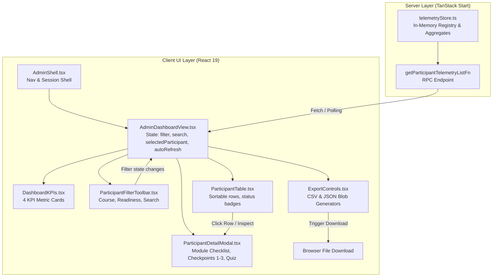

# Phase 31 Research: Admin Command Center Dashboard & Participant Progress Monitoring

**Target Output**: `.planning/phases/31-admin-command-center-dashboard-participant-progress-monitori/31-RESEARCH.md`  
**Dependencies**: Phase 29 (Master Admin Authentication & Route Protection), Phase 30 (Server Telemetry Ingestion API & Participant Background Client)  
**Requirements Addressed**: `ADMIN-DASH-01`, `ADMIN-DASH-02`, `ADMIN-DASH-03`, `ADMIN-DASH-04`  

---

## 1. Executive Summary & Goals

Phase 31 transitions the LearnWith administration system from backend telemetry ingestion (built in Phase 30) into an **instructor-facing Command Center Dashboard**. In workshop settings (both hands-on Agentic AI and advanced Word formatting for civil servants / ASN), instructors and administrative coordinators need immediate visual clarity on who is attending, how quickly participants are progressing through pre-training exercises, whether any participant is stuck at technical checkpoints, and who requires dedicated clinic interventions prior to in-person sessions.

### Primary Objectives:
1. **ADMIN-DASH-01 (KPI Metrics Cards):** Present 4 high-level aggregate cards: Total Active Participants (with live 15-minute recency indicators), Checkpoint Completion Rate across all modules, Average Quiz Score (Word module evaluation), and Workshop Readiness Ratio (`ready` vs `clinic`).
2. **ADMIN-DASH-02 (Interactive Participant Directory Table):** Provide a real-time table of participants supporting multi-criteria filtering by course (`ai` vs `word`), readiness status (`ready`, `clinic`, `pending`), real-time activity status (active vs idle), and rapid case-insensitive search by participant name, agency/unit kerja, or participant ID.
3. **ADMIN-DASH-03 (Participant Detail Inspector Modal/Drawer):** Enable instructors to click any participant to inspect their complete progress dossier: granular checklist items completed, history and status of Checkpoints 1–3, quiz evaluation scores (if applicable), and device/activity metadata.
4. **ADMIN-DASH-04 (1-Click CSV & JSON Export Engine):** Enable immediate browser-side generation and download of complete progress recapitulation data in valid RFC 4180 CSV (with Excel-friendly UTF-8 BOM) and structured JSON formats.

---

## 2. Existing Codebase Analysis & Data Contract

### 2.1 Existing Telemetry Subsystem [VERIFIED: app/schemas/telemetry.ts#L1-L58]

The schema layer in [app/schemas/telemetry.ts](file:///C:/Users/yudhiar/Downloads/AgenticAI/app/schemas/telemetry.ts) establishes canonical types and validation schemas:
- `checkpointStatusSchema = z.enum(['pending', 'passed', 'failed'])`
- `readinessStatusSchema = z.enum(['ready', 'clinic', 'pending'])`
- `participantTelemetrySchema`:
  - `participantId: string` (1–64 characters)
  - `name: string` (default: `'Peserta'`)
  - `agency: string` (default: `'-'`)
  - `courseId: 'ai' | 'word'`
  - `progressPercent: number` (0–100)
  - `completedTasks: number`
  - `totalTasks: number`
  - `checkpoints: Record<string, 'pending' | 'passed' | 'failed'>`
  - `readinessStatus: 'ready' | 'clinic' | 'pending'`
  - `quizScore?: number` (0–100)
  - `clientTimestamp: number`
- `participantRecordSchema`: Extends `participantTelemetrySchema` with `serverReceivedAt: number` and `lastActiveAt: number`.
- `telemetryQueryFilterSchema`:
  - `courseId: 'all' | 'ai' | 'word'` (default: `'all'`)
  - `readiness: 'all' | 'ready' | 'clinic' | 'pending'` (default: `'all'`)
  - `search?: string`
- `telemetryDashboardStatsSchema`:
  - `totalParticipants: number`
  - `activeParticipants: number` (calculated using a 15-minute recency window: `now - 15 * 60 * 1000`)
  - `checkpointCompletionRate: number` (percentage of passed checkpoints out of total possible checkpoints)
  - `averageQuizScore: number` (average across participants who submitted quiz scores)
  - `readyRatio: number` (percentage of participants with status `'ready'`)
  - `clinicRatio: number` (percentage of participants with status `'clinic'`)

### 2.2 Server Functions & Store [VERIFIED: app/server/telemetryStore.ts, app/server/telemetry.ts]

In [app/server/telemetryStore.ts](file:///C:/Users/yudhiar/Downloads/AgenticAI/app/server/telemetryStore.ts):
- `getParticipants(filter?: TelemetryQueryFilter): ParticipantRecord[]`: Returns participants sorted descending by `lastActiveAt`. Seeds 8 realistic demo participants if the registry is empty [VERIFIED: app/server/telemetryStore.ts#L138-L266].
- `getParticipantById(id: string): ParticipantRecord | null`: Retrieves a single participant record.
- `getTelemetryStats(): TelemetryDashboardStats`: Calculates real-time aggregate KPI metrics with zero-division safety guards [VERIFIED: app/server/telemetryStore.ts#L73-L133].

In [app/server/telemetry.ts](file:///C:/Users/yudhiar/Downloads/AgenticAI/app/server/telemetry.ts):
- `getParticipantTelemetryListFn = createServerFn({ method: 'GET' })`: Validates input with `telemetryQueryFilterSchema` and returns `{ participants: ParticipantRecord[]; stats: TelemetryDashboardStats }`.

### 2.3 Proposed Data Model Enhancement: Granular Task Checklist

While `completedTasks` and `totalTasks` are recorded, requirement `ADMIN-DASH-03` requires inspecting the specific checklist items completed by the participant.
In client state:
- AI Course: `memoryState.checklists` contains task keys like `m1-check-node`, `m2-install-pkg`, `m3-start-botfather` [VERIFIED: app/hooks/usePretrainingState.ts#L31-L49].
- Word Course: `parsed.checklists` contains task keys like `word-b1-nav-ribbon`, `word-b4-mailmerge` [VERIFIED: app/routes/course.word.tsx#L78-L80].

**Enhancement (Backwards-Compatible):**
Add an optional `taskChecklist?: Record<string, boolean>` field to `participantTelemetrySchema` and `participantRecordSchema`:
```typescript
taskChecklist: z.record(z.string(), z.boolean()).optional()
```
This preserves full compatibility with Phase 30 tests while allowing rich checklist visualization in the detail drawer. Seed data in `telemetryStore.ts` can be populated with typical completed/pending tasks for both courses.

---

## 3. Architecture & Component Hierarchy

### 3.1 Integration within Admin Shell

Currently, [app/components/admin/AdminShell.tsx](file:///C:/Users/yudhiar/Downloads/AgenticAI/app/components/admin/AdminShell.tsx#L84-L135) renders tabs:
1. `dashboard` (`"📊 Dashboard & Monitoring"`)
2. `telemetry` (`"👥 Peserta & Telemetri"`)
3. `passkeys` (`"🔑 Passkey Modul Dinas"` - Roadmap Phase 32)
4. `troubleshooting` (`"🛠️ Log Kendala"` - Roadmap Phase 32)
5. `settings` (`"⚙️ Pengaturan Platform"` - Roadmap Phase 33)

Currently, `admin.tsx` renders `<AdminShell>` with no children, falling back to a static placeholder card.
For Phase 31, we wire `activeTab === 'dashboard' || activeTab === 'telemetry'` directly to the new Command Center Dashboard component (`AdminDashboardView`), allowing seamless switching and tab-specific focus (e.g. `dashboard` defaults to KPI cards + live feed, `telemetry` focuses on the comprehensive participant table).

### 3.2 Component Breakdown

```
app/components/admin/
├── AdminShell.tsx                    // Shell header, nav tabs, session status, logout button
├── AdminDashboardView.tsx            // Main container: state management, polling, layout
├── DashboardKPIs.tsx                 // ADMIN-DASH-01: 4 Aggregate KPI summary cards
├── ParticipantFilterToolbar.tsx      // ADMIN-DASH-02: Course selector, readiness filter, search input, reset
├── ParticipantTable.tsx              // ADMIN-DASH-02: Responsive table, sorting, badges, action buttons
├── ParticipantDetailModal.tsx        // ADMIN-DASH-03: Dialog drawer showing tasks, checkpoints, quiz
└── ExportControls.tsx                // ADMIN-DASH-04: 1-click CSV & JSON export buttons + toast
```

### 3.3 Component State & Data Flow



---

## 4. UI/UX & Design System Integration

### 4.1 Visual Tokens & Consistency [VERIFIED: assets/css/main.css, assets/css/admin.css]

The dashboard must adhere strictly to the established LearnWith design language:
- **Canvas Background:** `var(--bg-canvas, #0d1117)` with subtle radial lighting gradient.
- **Surface Elevation:** `var(--bg-surface, #161b22)` for cards, tables, and modal dialogs; `var(--bg-surface-subtle, #0d1117)` for nested containers.
- **Border Treatment:** `1px solid var(--border-subtle, rgba(240, 246, 252, 0.1))` with standard border radiuses (`var(--radius-md, 8px)`, `var(--radius-lg, 12px)`, `var(--radius-xl, 16px)`).
- **Accents:**
  - Cobalt Blue / Sky (`var(--accent-primary, #38bdf8)`): Navigation, primary highlights, progress bars.
  - Green (`#22c55e` / `rgba(34, 197, 94, 0.15)`): Passed checkpoints, ready status, active participants.
  - Rose / Red (`#ef4444` / `rgba(239, 68, 68, 0.15)`): Failed checkpoints, clinic status, error alerts.
  - Amber / Yellow (`#f59e0b` / `rgba(245, 158, 11, 0.15)`): Pending checkpoints, in-progress tasks.

### 4.2 KPI Summary Cards (ADMIN-DASH-01)

Layout: 4-column responsive grid (`grid-template-columns: repeat(auto-fit, minmax(240px, 1fr))`).

| Card | Primary Value | Context / Subtitle | Visual Element |
| :--- | :--- | :--- | :--- |
| **Total Peserta Terdaftar** | `stats.totalParticipants` | `stats.activeParticipants` aktif (15 mnt) | Pulsing live green dot |
| **Kelulusan Checkpoint** | `${stats.checkpointCompletionRate}%` | Akumulasi CP 1–3 seluruh modul | Mini progress fill bar |
| **Rata-rata Evaluasi Kuis** | `${stats.averageQuizScore} / 100` | Berdasarkan peserta modul evaluasi | Score badge (>=70 green, <70 amber) |
| **Kesiapan Workshop** | `${stats.readyRatio}% Siap` | `${stats.clinicRatio}% Perlu Klinik` | Split ratio comparative bar |

### 4.3 Participant Progress Table (ADMIN-DASH-02)

Table structure:
1. **Kolom Peserta:** Nama lengkap, instansi (e.g. "Diskominfotik DKI Jakarta"), ID peserta mono (`usr-...`).
2. **Kolom Kursus:** Badge kursus (`🤖 AI` vs `📝 Word`).
3. **Kolom Progres:** Angka persentase bold, progress bar visual (60% tasks + 40% checkpoints), keterangan counter (`X/Y tugas`).
4. **Kolom Checkpoint:** 3 mini pills horizontal:
   - CP1, CP2, CP3 with icons `✓` (hijau), `✗` (merah), `○` (kuning/abu-abu).
5. **Kolom Nilai Kuis:** Nilai angka (`90/100`) atau tanda hubung (`—`) untuk kursus AI.
6. **Kolom Status Kesiapan:**
   - **Siap Workshop:** Green pill + checkmark.
   - **Perlu Klinik:** Red pill + alert icon.
   - **Masih Berprogres:** Yellow/amber pill + clock icon.
7. **Kolom Aktivitas Terakhir:** Teks waktu relatif (e.g., "3 mnt lalu", "1 jam lalu") dengan titik indikator status aktif (hijau untuk <=15 mnt, abu-abu untuk >15 mnt).
8. **Kolom Aksi:** Tombol `"Inspeksi"` / icon mata untuk membuka detail modal.

### 4.4 Participant Detail Modal / Drawer (ADMIN-DASH-03)

- **Backdrop:** Accessible backdrop (`background: rgba(0, 0, 0, 0.7); backdrop-filter: blur(4px)`).
- **Dialog Attributes:** `role="dialog"`, `aria-modal="true"`, `aria-labelledby="modal-title"`.
- **Keyboard Handling:** ESC key triggers close; tab focus trapped within modal; autofocus close button on open.
- **Content Sections:**
  1. *Header:* Nama peserta, instansi, ID, badge kursus, tombol tutup (`✕`).
  2. *Status Kesiapan:* Banner besar status kesiapan dengan deskripsi tindak lanjut instruktur.
  3. *Riwayat Checkpoint 1–3:*
     - CP-1: Verifikasi Lingkungan / Format Dasar (Status, tanggal/waktu).
     - CP-2: Uji Kredensial / Tata Naskah (Status, tanggal/waktu).
     - CP-3: Validasi Integrasi / Finalisasi Dokumen (Status, tanggal/waktu).
  4. *Evaluasi Kuis:*
     - Skor kuis (e.g., `95/100`), status kelulusan passing grade (ambang batas 70), atau catatan bahwa evaluasi AI berbasis checkpoint langsung.
  5. *Rincian Checklist Modul:*
     - Daftar tugas terstruktur per modul/bab (misal Modul 1: Node.js, Modul 2: 9Router, Modul 3: Telegram Bot, Modul 4: Console).
     - Status centang hijau (`✓ Selesai`) atau lingkaran abu-abu (`○ Belum`).

---

## 5. Export Engine Architecture (ADMIN-DASH-04)

### 5.1 Standards & Specifications

Exporting participant data must follow standard browser file generation rules:
- **No External Libraries Required:** Browser-native `Blob` and `URL.createObjectURL` provide zero-dependency, high-speed export.
- **Encoding:** UTF-8.
- **Excel Indonesian Compatibility:** Prepend UTF-8 Byte Order Mark (`\uFEFF`) to CSV exports. Without BOM, Excel on Windows defaults to Windows-1252/ANSI, garbling non-ASCII characters, accents, or Indonesian punctuation.
- **CSV Formula Injection Sanitization:** If any cell value begins with dangerous characters (`=`, `+`, `-`, `@`, `\t`, `\r`), prefix the value with a single quote (`'`) to prevent formula execution if opened in spreadsheets.
- **RFC 4180 Escaping:** If a cell contains a comma (`,`), double quote (`"`), or newline (`\n`), wrap the entire value in double quotes and escape internal quotes by doubling them (`""`).

### 5.2 CSV Column Structure

```csv
"ID Peserta","Nama Peserta","Instansi / Unit Kerja","Kategori Kursus","Progres (%)","Tugas Selesai","Total Tugas","Checkpoint 1","Checkpoint 2","Checkpoint 3","Skor Kuis","Status Kesiapan","Waktu Terdaftar","Aktivitas Terakhir"
```

### 5.3 JSON Schema Structure

The JSON export provides full structural fidelity for programmatic analysis:

```json
{
  "exportedAt": "2026-09-09T04:30:00.000Z",
  "exportedBy": "Master Admin",
  "version": "1.0",
  "totalRecords": 8,
  "summary": {
    "totalParticipants": 8,
    "activeParticipants": 3,
    "checkpointCompletionRate": 75,
    "averageQuizScore": 85,
    "readyRatio": 50,
    "clinicRatio": 25
  },
  "filtersApplied": {
    "courseId": "all",
    "readiness": "all",
    "search": ""
  },
  "participants": [
    {
      "participantId": "usr-ai-01",
      "name": "Ahmad Fauzi, S.Kom",
      "agency": "Diskominfotik DKI Jakarta",
      "courseId": "ai",
      "progressPercent": 100,
      "completedTasks": 13,
      "totalTasks": 13,
      "checkpoints": { "cp-1": "passed", "cp-2": "passed", "cp-3": "passed" },
      "readinessStatus": "ready",
      "quizScore": null,
      "serverReceivedAt": 1725856200000,
      "lastActiveAt": 1725856260000
    }
  ]
}
```

### 5.4 Download Trigger Helper

```typescript
export function triggerFileDownload(content: string, filename: string, mimeType: string): void {
  const blob = new Blob([content], { type: mimeType })
  const url = URL.createObjectURL(blob)
  const anchor = document.createElement('a')
  anchor.href = url
  anchor.download = filename
  document.body.appendChild(anchor)
  anchor.click()
  document.body.removeChild(anchor)
  setTimeout(() => URL.revokeObjectURL(url), 1000)
}
```

---

## 6. Pitfalls & What NOT to Hand-Roll

| Topic | Pitfall | Recommended Approach |
| :--- | :--- | :--- |
| **Charting Libraries** | Importing heavy libraries like `Chart.js`, `Recharts`, or `D3` introduces megabytes of client bundle size for simple metrics. | **Don't use external chart libraries.** The 4 KPI cards only need clean typography, SVG icons, and pure CSS progress bars/split bars (`var(--accent-primary)`, `border-radius`). |
| **Hydration Mismatches** | Rendering dynamic timestamps like `Date.now()` or relative times ("2 menit lalu") on the server causes SSR hydration mismatches with client time. | Calculate relative times either purely client-side inside `useEffect`, or use ISO string timestamps with a mounted state check (`isMounted`). |
| **Excel CSV Punctuation** | Indonesian Excel installations often use semicolon (`;`) instead of comma (`,`) or corrupt UTF-8 text without BOM. | Always include the `\uFEFF` BOM at the start of CSV strings. Standard comma-separated format with RFC 4180 quotation ensures compatibility across Google Sheets, LibreOffice, and modern Excel. |
| **Formula Injection in CSV** | Participant names or agencies starting with `=`, `+`, `-`, or `@` can trigger remote code execution or spreadsheet formula alerts. | Sanitize CSV values: prepend single quote (`'`) to strings starting with dangerous formula characters. |
| **Polling Floods** | Rapid unrestricted `setInterval` querying the server can congest low-spec workshop machines or local docker containers. | Use controlled 15-second polling interval with an explicit "Pause/Resume" toggle and a manual "Segarkan Sekarang" button with loading debounce. |
| **Zero/Empty State Handling** | If all participants are deleted or filtered out, `totalParticipants === 0` causes `NaN%` from `0 / 0`. | Store functions already guard with `if (totalParticipants === 0) return 0` [VERIFIED: app/server/telemetryStore.ts#L79-L88]. Frontend components must mirror these fallbacks. |

---

## 7. Verification & Validation Strategy

### 7.1 Existing Test Suite Context [VERIFIED: tests/telemetry.test.js, package.json]

The repository uses Node's native test runner (`node --test tests/*.test.js`) executed via Node v22.22.3 [VERIFIED: node -v -> v22.22.3].
Currently, `tests/telemetry.test.js` runs 20 tests across 5 suites with 100% pass rate.

### 7.2 Dedicated Phase 31 Test Plan: `tests/admin-dashboard.test.js`

We will implement automated unit and integration tests covering all 4 requirements:

1. **Suite 1: KPI Aggregation & Zero-division Safety (ADMIN-DASH-01)**
   - Computes correct aggregate stats for active participants (15-minute cutoff).
   - Computes accurate checkpoint completion percentage across heterogeneous courses.
   - Computes average quiz score strictly from participants with valid quiz records.
   - Computes ready and clinic ratios accurately.
   - Handles empty registry safely without `NaN` or runtime exceptions.

2. **Suite 2: Multi-Criteria Filtering & Search Engine (ADMIN-DASH-02)**
   - Filters participants by `courseId` (`all`, `ai`, `word`).
   - Filters participants by `readinessStatus` (`all`, `ready`, `clinic`, `pending`).
   - Performs case-insensitive search matching participant name, agency, and ID.
   - Verifies combined multi-filter narrowing (e.g. `word` + `clinic` + search `"Dinas"`).
   - Detects active vs inactive participants based on timestamp thresholds.

3. **Suite 3: Detail Inspector Data Integrity (ADMIN-DASH-03)**
   - Verifies retrieval of full participant records by ID.
   - Verifies detailed checkpoint statuses (CP1, CP2, CP3) mapped accurately.
   - Verifies quiz score parsing and passing threshold validation.
   - Verifies modular task checklist items mapping (AI module tasks and Word checklist tasks).

4. **Suite 4: Export Engine Formatting & Security (ADMIN-DASH-04)**
   - Verifies CSV generation includes `\uFEFF` UTF-8 BOM.
   - Verifies proper RFC 4180 double-quote escaping for values with commas and quotes.
   - Verifies CSV formula injection protection for inputs starting with `=`, `+`, `-`, `@`.
   - Verifies JSON export generates valid JSON matching schema with metadata and aggregates.

5. **Suite 5: Security & Secret Quarantine (ADMIN-QA-01, ADMIN-QA-02)**
   - Verifies no server secrets (`ADMIN_PASSKEY`, `SESSION_SECRET`, `TELEGRAM_BOT_TOKEN`, `GOOGLE_CLIENT_SECRET`) are imported or leaked in admin dashboard components or export utilities.

---

## 8. Implementation Roadmap & Plan Breakdown

Phase 31 can be cleanly executed in **2 sequential plans**:

- **Plan 31-01:** Core Dashboard & Monitoring Table
  - Task 1: Data model enhancement (`taskChecklist` optional schema & seed data enrichment in `telemetryStore.ts`).
  - Task 2: Build `DashboardKPIs.tsx` (4 aggregate metric cards with live indicators) and `ParticipantFilterToolbar.tsx` (course, readiness, search).
  - Task 3: Build `ParticipantTable.tsx` (responsive table with badges, progress bars, checkpoint status indicators, and relative time).
  - Task 4: Integrate into `AdminShell.tsx` and verify rendering on `/admin`.

- **Plan 31-02:** Detail Inspector Modal, Export Engine & Verification
  - Task 1: Build `ParticipantDetailModal.tsx` (accessible drawer with module checklist breakdown, checkpoints 1–3 history, and quiz evaluation).
  - Task 2: Build `ExportControls.tsx` & export utility (`app/utils/adminExport.ts`) for 1-click CSV (with BOM + escaping) and JSON downloads.
  - Task 3: Style polish in `assets/css/admin.css` and mirror to `public/assets/css/admin.css`.
  - Task 4: Create and run comprehensive test suite `tests/admin-dashboard.test.js` validating all requirements (`ADMIN-DASH-01` through `ADMIN-DASH-04`).

---

## RESEARCH COMPLETE
