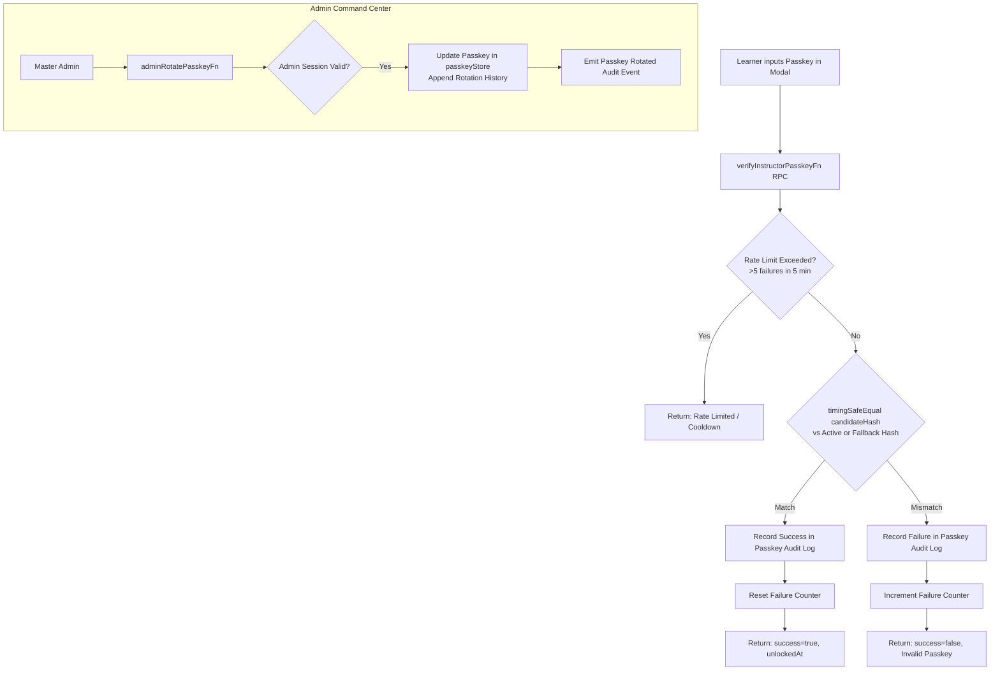
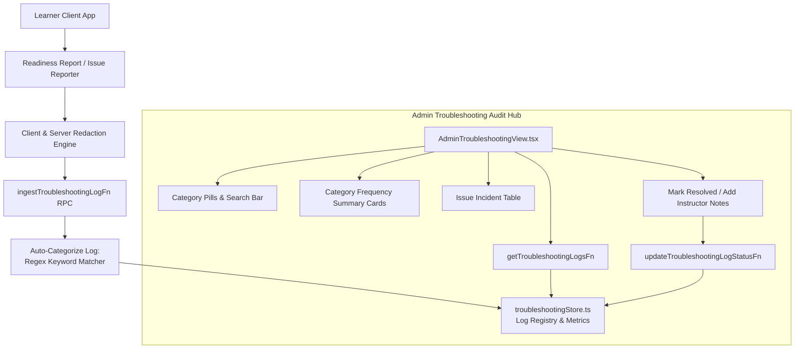

# Phase 32 Research: Workshop Access Passkey Management & Troubleshooting Audit Hub

**Target Output**: `.planning/phases/32-workshop-access-passkey-management-troubleshooting-audit-hub/32-RESEARCH.md`  
**Dependencies**: Phase 29 (Master Admin Authentication & Route Protection), Phase 30 (Server Telemetry Ingestion API), Phase 31 (Admin Command Center Dashboard)  
**Requirements Addressed**: `ADMIN-PASS-01`, `ADMIN-PASS-02`, `ADMIN-PASS-03`, `ADMIN-LOG-01`, `ADMIN-LOG-02`  

---

## 1. Executive Summary & Domain Scope

Phase 32 builds the fourth and fifth core administrative modules inside the LearnWith Command Center:
1. **Workshop Access Passkey Management & Unlock Audit Hub (`ADMIN-PASS-01`, `ADMIN-PASS-02`, `ADMIN-PASS-03`)**:
   - Instructors and BPSDM coordinators manage access passkeys for locked workshop tracks (specifically Course 2: Pengolahan Kata Tingkat Lanjut ASN, as well as live Agentic AI sessions).
   - Currently, passkeys are verified via `verifyInstructorPasskeyFn` in `app/server/auth.ts`, checking static environment variables or hardcoded hash fallbacks (`DEFAULT_WORD_PASSKEY_HASH` and `DEFAULT_AI_PASSKEY_HASH` in `app/server/config.ts`).
   - Phase 32 introduces a dynamic, verified server-side passkey management engine allowing administrators to:
     - Monitor active passkey status, current SHA-256 hash preview, and rotation history with timestamps (`ADMIN-PASS-01`).
     - Dynamically rotate or update the passkey at runtime without server downtime or redeployment (`ADMIN-PASS-02`), keeping backward-compatible fallback hashes.
     - Inspect audit logs of all learner unlock attempts with client identifiers, outcome (`success` vs `failed`), failure streaks, and a rate-limiting defense guard against brute-force guessing (`ADMIN-PASS-03`).
2. **Learner Troubleshooting Audit Hub & Aggregation (`ADMIN-LOG-01`, `ADMIN-LOG-02`)**:
   - In classroom settings, learners encounter environment-specific runtime issues: port 20128 conflict (`EADDRINUSE`), PowerShell execution policy restrictions (`running scripts is disabled`), OAuth/API key errors (`401 Unauthorized`), and Telegram bot polling conflicts (`409 Conflict`).
   - Learners generate readiness reports containing sanitized terminal error messages (via `PretrainingReadinessReportSection` and `sanitizeLogText`).
   - Phase 32 creates an ingestible, structured runtime issue logging hub:
     - Ingests learner-reported troubleshooting issues or client error payloads (with automatic secret redaction).
     - Aggregates technical issues into categorized buckets (Port Conflict, PowerShell Security, OAuth/API Key, Telegram Gateway, Node/npm runtime).
     - Provides instructor-facing search and filtering by category, severity, and frequency to guide real-time classroom intervention (`ADMIN-LOG-01`, `ADMIN-LOG-02`).

---

## 2. Existing Architecture & Codebase Patterns

### 2.1 Current Passkey Verification Flow

1. **Client Unlock Modal**:
   - [app/components/course/InstructorUnlockModal.tsx](file:///c:/Users/yudhiar/Downloads/AgenticAI/app/components/course/InstructorUnlockModal.tsx) renders when learners or instructors click "Buka Kunci Instruktur (Passkey)".
   - Calls `verifyInstructorPasskeyFn({ data: { courseId, passkey } })`.
   - On success, sets session storage (`learnwith_word_unlocked` or `live_class_unlocked`) and informs parent routes.
2. **Server Verification RPC**:
   - [app/server/auth.ts](file:///c:/Users/yudhiar/Downloads/AgenticAI/app/server/auth.ts) defines `verifyInstructorPasskeyFn`:
     ```typescript
     export const verifyInstructorPasskeyFn = createServerFn({ method: 'POST' })
       .validator((data: unknown) => verifyPasskeyInputSchema.parse(data))
       .handler(async ({ data }): Promise<VerifyPasskeyResult> => {
         const isAuthorized = verifyPasskeyWithHash(data.courseId, data.passkey)
         ...
       })
     ```
3. **Hashing & Timing-Safe Comparison**:
   - [app/server/config.ts](file:///c:/Users/yudhiar/Downloads/AgenticAI/app/server/config.ts#L45-L65) defines `verifyPasskeyWithHash`:
     - Compares candidate SHA-256 against target hash (`config.wordPasskeyHash` or `config.aiPasskeyHash`).
     - Uses `crypto.timingSafeEqual` with buffer length checking.
   - Default hashes in `config.ts`:
     - Course 1 ('buka-kelas'): `b99674726766354e30a414680548a5943f0ded595e286bec3355a016e87e362f`
     - Course 2 ('buka-kata'): `ddf62f4013c59b111215312fb959629155a5b1dc5cf799f2053a8c2395c4511b`
     - Admin ('admin-learnwith'): `5e5dc93b4232b40fc465e93816ffed9075952c54d9c7536cded05ec4bb255fe3`

### 2.2 Existing Admin Architecture & Session Protection

1. **Admin Authentication**:
   - [app/server/adminAuth.ts](file:///c:/Users/yudhiar/Downloads/AgenticAI/app/server/adminAuth.ts) and [app/server/session.ts](file:///c:/Users/yudhiar/Downloads/AgenticAI/app/server/session.ts) enforce HttpOnly session cookies (`learnwith_admin_session`) with 256-bit entropy tokens and 24-hour TTL.
   - Admin server functions can verify active sessions via `readSessionToken()` and `validateAdminSession(token)`.
2. **Admin UI Tabs**:
   - [app/components/admin/AdminShell.tsx](file:///c:/Users/yudhiar/Downloads/AgenticAI/app/components/admin/AdminShell.tsx) contains nav tabs:
     - `dashboard` -> `AdminDashboardView` (KPIs, active participants)
     - `telemetry` -> `AdminDashboardView` (Directory, search, export)
     - `passkeys` -> Currently renders `.admin-placeholder-card` ("Manajemen Passkey Modul Dinas")
     - `troubleshooting` -> Currently renders `.admin-placeholder-card` ("Log Kendala & Export Laporan")
     - `settings` -> Platform settings (Phase 33)

### 2.3 Troubleshooting Data & Sanitization Capabilities

1. **Troubleshooting Catalog**:
   - [app/data/pretrainingTroubleshooting.ts](file:///c:/Users/yudhiar/Downloads/AgenticAI/app/data/pretrainingTroubleshooting.ts) defines 15 strongly typed troubleshooting items with categories: `node`, `router`, `telegram`, `hermes`, `powershell`.
   - Items specifically cover:
     - Port 20128 conflict: `trbl-router-eaddrinuse` (EADDRINUSE)
     - PowerShell policy: `trbl-ps-execution-policies` (running scripts disabled)
     - OAuth/API Key: `trbl-router-401-unauthorized` (401 Unauthorized / Invalid API Key)
     - Telegram conflict: `trbl-tg-409-conflict` (Telegram 409 Conflict getUpdates)
2. **Redaction Engine**:
   - [app/utils/redaction.ts](file:///c:/Users/yudhiar/Downloads/AgenticAI/app/utils/redaction.ts) exports `sanitizeLogText(rawText)` which redacts Telegram tokens, OpenAI/Gemini keys, Bearer tokens, emails, and Windows user paths (`C:\Users\[USER]\...`).
3. **Telemetry Heartbeat Client**:
   - [app/utils/telemetryClient.ts](file:///c:/Users/yudhiar/Downloads/AgenticAI/app/utils/telemetryClient.ts) maintains a persistent anonymous client ID (`getOrCreateClientId()`, e.g. `usr-timestamp-random`), which can be passed along with unlock attempts and troubleshooting reports.

---

## 3. Detailed Architectural Design

### 3.1 Workshop Passkey Store & Rotation Engine (`ADMIN-PASS-01`, `ADMIN-PASS-02`, `ADMIN-PASS-03`)

#### 3.1.1 State Model (`app/server/passkeyStore.ts`)
To support runtime rotation without restarting the process while preserving default fallback behavior:
- **Active Passkey Record**:
  - `courseId: 'ai' | 'word'`
  - `currentHash: string` (SHA-256 of active passkey)
  - `activePasskeyClearTextPreview?: string` (masked preview, e.g. `buk****ta` or only visible to admin)
  - `lastRotatedAt: number`
  - `rotatedBy: string` (e.g. `'master-admin'`)
  - `version: number`
  - `status: 'active' | 'deprecated'`
- **Passkey Rotation History**:
  - Array of previous rotations: `{ version, hash, rotatedAt, rotatedBy, reason? }`.
- **Unlock Attempt Audit Log**:
  - `attemptId: string`
  - `courseId: 'ai' | 'word'`
  - `timestamp: number`
  - `clientId: string`
  - `ipAddress?: string` (or client origin header)
  - `success: boolean`
  - `attemptHashPrefix: string` (first 8 chars of candidate hash, never store raw candidate)
  - `failureReason?: string`
- **Rate-Limiting Guard**:
  - Track consecutive failed attempts per `clientId` or IP within a rolling 5-minute sliding window.
  - If failures exceed threshold (e.g., 5 failures in 5 minutes), block subsequent verification requests for that client for 2 minutes (cooldown response with HTTP 429 semantics / `rateLimited: true`).



#### 3.1.2 Server Functions for Passkey Operations (`app/server/passkey.ts`)
1. `adminGetPasskeyStatusFn` (`GET`):
   - Protected: requires admin session.
   - Returns current active passkeys for courses (`ai`, `word`), active status, hash preview, rotation history, and recent unlock attempts.
2. `adminRotatePasskeyFn` (`POST`):
   - Protected: requires admin session.
   - Validates input schema: `courseId: 'ai' | 'word'`, `newPasskey: string` (min 6 chars, max 64 chars), `reason?: string`.
   - Computes SHA-256 hash of `newPasskey.trim().toLowerCase()`.
   - Appends old state to `rotationHistory`.
   - Updates active hash and `lastRotatedAt`.
   - Returns `{ success: true, version, hashPreview, rotatedAt }`.
3. `adminGetPasskeyAuditLogsFn` (`GET`):
   - Protected: requires admin session.
   - Returns paginated or filtered unlock attempts: filter by `courseId`, `status: 'all' | 'success' | 'failed'`, and time range.
4. `verifyInstructorPasskeyFn` (`POST`) [Update in `app/server/auth.ts`]:
   - Integrates with `passkeyStore.ts`:
     - Checks rate limit for client.
     - Tests candidate hash against dynamic active hash first, falling back to static config hash.
     - Logs the unlock attempt to `passkeyStore.recordUnlockAttempt(...)`.
     - Returns result with rate limit information if throttled.

---

### 3.2 Troubleshooting Log Hub & Aggregation (`ADMIN-LOG-01`, `ADMIN-LOG-02`)

#### 3.2.1 Troubleshooting Issue Category Taxonomy
Matching the actual classroom failure modes:
1. `port_conflict`:
   - Matches: `20128`, `EADDRINUSE`, `address already in use`, `port`.
   - Guidance: `Stop-Process -Id (Get-NetTCPConnection -LocalPort 20128).OwningProcess -Force`.
2. `powershell_policy`:
   - Matches: `Execution_Policies`, `running scripts is disabled`, `PSScriptRoot`, `Set-ExecutionPolicy`.
   - Guidance: `Set-ExecutionPolicy -Scope Process -ExecutionPolicy Bypass`.
3. `oauth_api_key`:
   - Matches: `401 Unauthorized`, `Invalid API Key`, `GOOGLE_CLIENT_ID`, `AIza`, `gemini`.
   - Guidance: Verify API key in 9Router or re-issue token in Google Cloud / AI Studio.
4. `telegram_conflict`:
   - Matches: `409 Conflict`, `getUpdates`, `terminated by other`, `hermes gateway`.
   - Guidance: Terminate redundant bot instances with `hermes gateway stop`.
5. `permissions_eperm`:
   - Matches: `EPERM`, `Access denied`, `Permission denied`, `Run as administrator`.
   - Guidance: Open PowerShell as Administrator for global package installation.
6. `network_runtime`:
   - Matches: `ETIMEDOUT`, `ENOTFOUND`, `ECONNREFUSED`, `fetch failed`, general network hiccups.
7. `other`:
   - Uncategorized issues.

#### 3.2.2 State Model (`app/server/troubleshootingStore.ts`)
- **Troubleshooting Log Record**:
  - `id: string` (`log-${timestamp}-${random}`)
  - `timestamp: number`
  - `participantId: string` (anonymous client ID or name if provided)
  - `courseId: 'ai' | 'word' | 'system'`
  - `category: 'port_conflict' | 'powershell_policy' | 'oauth_api_key' | 'telegram_conflict' | 'permissions_eperm' | 'network_runtime' | 'other'`
  - `severity: 'low' | 'medium' | 'high' | 'critical'`
  - `rawErrorText: string` (automatically sanitized via `sanitizeLogText`)
  - `problemStep?: string` (e.g. `'Modul 2 Langkah B'`)
  - `os?: string` (e.g. `'Windows 11'`, `'Windows 10'`)
  - `status: 'open' | 'investigating' | 'resolved'`
  - `instructorNotes?: string`
- **Aggregated Incident Stats**:
  - Total incident count.
  - Frequency count per category (e.g. 12 Port Conflicts, 8 PowerShell Policies).
  - Open vs Resolved count.
  - Most frequent error step / keyword.



#### 3.2.3 Server Functions for Troubleshooting (`app/server/troubleshooting.ts`)
1. `ingestTroubleshootingLogFn` (`POST`):
   - Public/Participant endpoint (with rate guard).
   - Validates input: `participantId`, `courseId`, `errorMsg`, `problemStep`, `os`.
   - Runs `sanitizeLogText` on `errorMsg` to ensure zero token leakage.
   - Automatically classifies into a `category` based on keyword regex.
   - Stores in `troubleshootingStore`.
   - Returns `{ success: true, logId: record.id }`.
2. `getTroubleshootingLogsFn` (`GET`):
   - Protected: requires admin session.
   - Validator: `{ category?: string, severity?: string, status?: string, search?: string, courseId?: string }`.
   - Returns `{ logs: TroubleshootingLogRecord[], stats: TroubleshootingStats }`.
3. `updateTroubleshootingLogStatusFn` (`POST`):
   - Protected: requires admin session.
   - Allows instructors to mark issue as `resolved` or `investigating`, and attach `instructorNotes`.

---

### 3.3 UI Components for Admin Command Center

Following the modular pattern established in Phase 31:
```
app/components/admin/
├── AdminShell.tsx                      // Tabs: dashboard, telemetry, passkeys, troubleshooting, settings
├── passkeys/
│   ├── AdminPasskeyView.tsx            // Main Passkey Management tab view
│   ├── PasskeyStatusCards.tsx          // Cards showing Course 2 & Course 1 active status, hash preview, version
│   ├── PasskeyRotateModal.tsx          // Modal to rotate/update passkey with validation & confirmation
│   ├── PasskeyHistoryTable.tsx         // Table showing rotation timestamp history & versioning
│   └── PasskeyAuditLogTable.tsx        // Table showing unlock attempts, IP/client ID, success/failure, rate limit status
└── troubleshooting/
    ├── AdminTroubleshootingView.tsx    // Main Troubleshooting Hub tab view
    ├── TroubleshootingKPIs.tsx         // Frequency badges by category (Port, PowerShell, OAuth, Telegram)
    ├── TroubleshootingFilterToolbar.tsx// Category selector, status toggle (open/resolved), search input
    ├── TroubleshootingLogTable.tsx     // Incident table with severity pills, sanitized error snippets, expand drawer
    └── TroubleshootingDetailModal.tsx  // Drawer showing complete sanitized stack trace, OS, suggested resolution command
```

In [AdminShell.tsx](file:///c:/Users/yudhiar/Downloads/AgenticAI/app/components/admin/AdminShell.tsx#L141-L150):
- Replace `activeTab === 'passkeys'` placeholder with `<AdminPasskeyView />`.
- Replace `activeTab === 'troubleshooting'` placeholder with `<AdminTroubleshootingView />`.

---

## 4. Security & STRIDE Analysis

| Threat ID | STRIDE Category | Threat Description | Mitigation Strategy |
| :--- | :--- | :--- | :--- |
| **T-32-01** | **Information Disclosure** | Candidate passkey or secret stored in cleartext in server logs or response payloads. | Never store raw candidate passkey in audit logs; store only first 8 chars of SHA-256 hash (`attemptHashPrefix`). Never transmit cleartext passkey in public server function responses. |
| **T-32-02** | **Elevation of Privilege** | Unauthorized learner calls `adminRotatePasskeyFn` to change workshop passkey. | Strictly validate master admin session via `readSessionToken()` and `validateAdminSession()` before permitting any passkey rotation or admin log querying. |
| **T-32-03** | **Denial of Service / Brute Force** | Malicious actor brute-forces passkey unlock attempts on `verifyInstructorPasskeyFn`. | Implement rolling 5-minute sliding window rate-limiter in `passkeyStore`: maximum 5 failed attempts per client ID before triggering a 2-minute cooldown. |
| **T-32-04** | **Information Disclosure** | Learner-submitted error messages contain private API keys, Telegram bot tokens, or filesystem usernames. | Enforce dual-layer sanitization: client-side `sanitizeLogText` before sending, and server-side `sanitizeLogText` re-check upon ingestion into `troubleshootingStore`. |
| **T-32-05** | **Timing Attack** | Attacker measures string comparison duration to guess passkeys. | Maintain `crypto.timingSafeEqual` over fixed-length 32-byte SHA-256 buffers for all passkey verifications. |

---

## 5. Validation Architecture

To ensure zero regressions and robust quality assurance, Phase 32 will be verified across three testing tiers:

### 5.1 Automated Node Test Suites (`tests/admin-passkey.test.js` & `tests/admin-troubleshooting.test.js`)
1. **Passkey Management & Verification Suite (`tests/admin-passkey.test.js`)**:
   - `Suite 1: Active Passkey Retrieval & Hash Generation (ADMIN-PASS-01)`:
     - Default passkeys match initial hashes.
     - Hash preview is 64-char hex, masked cleartext preview displays safely.
     - Versioning defaults to v1 with valid initial timestamp.
   - `Suite 2: Dynamic Passkey Rotation Engine (ADMIN-PASS-02)`:
     - Admin rotation successfully updates active hash for Course 2 (`word`) and Course 1 (`ai`).
     - Previous hash is archived to `rotationHistory` with timestamp and reason.
     - Candidate verification verifies successfully with new passkey and fails with deprecated passkey.
     - Reject empty or short (<6 chars) new passkeys via Zod schema.
   - `Suite 3: Unlock Attempt Audit Logging & Rate Limiting (ADMIN-PASS-03)`:
     - Successful unlock attempt records `{ success: true, timestamp, clientId }`.
     - Failed unlock attempt records `{ success: false, failureReason }`.
     - Rate-limiting guard locks client after 5 consecutive failures within 5 minutes.
     - Rate-limiting releases after cooldown duration.
     - Unauthorized calls to rotation RPC return authorization error.

2. **Troubleshooting Audit Hub Suite (`tests/admin-troubleshooting.test.js`)**:
   - `Suite 1: Log Ingestion & Redaction Enforcement (ADMIN-LOG-01)`:
     - Ingests learner error logs and ensures secret tokens (Telegram token, Google/OpenAI keys, Windows paths) are masked.
     - Stores log with timestamp, clientId, OS, and step.
   - `Suite 2: Auto-Categorization Engine (ADMIN-LOG-01, ADMIN-LOG-02)`:
     - Classifies `EADDRINUSE: :::20128` as `port_conflict`.
     - Classifies `running scripts is disabled` as `powershell_policy`.
     - Classifies `401 Unauthorized` as `oauth_api_key`.
     - Classifies `Telegram 409 Conflict` as `telegram_conflict`.
     - Classifies `EPERM` as `permissions_eperm`.
     - Fallbacks cleanly to `other` for unrecognized strings.
   - `Suite 3: Aggregated Metrics & Filtering (ADMIN-LOG-02)`:
     - Correctly aggregates frequency counts across categories.
     - Filters logs by category, severity, status (`open` vs `resolved`), and search query.
     - Updates log status and instructor notes.

### 5.2 End-to-End Regression Verification
- Run existing full test suite: `npm test` (`node --test tests/*.test.js`).
- Verify all 23 existing test suites pass (179+ tests passing, 0 failures).
- Verify typecheck passes: `npx tsc --noEmit`.

---

## 6. Implementation Plan Recommendation

Phase 32 should be broken down into two structured plans:

- **Plan 32-01: Workshop Access Passkey Management, Dynamic Rotation & Rate-Guarded Audit Store**
  - Create `app/schemas/passkey.ts` for schemas & types.
  - Create `app/server/passkeyStore.ts` for in-memory passkey state, rotation history, audit logging, and sliding-window rate limiting.
  - Update `app/server/auth.ts` and `app/server/config.ts` to query dynamic active passkey and record audit attempts.
  - Create `app/server/passkey.ts` for admin RPC functions (`adminGetPasskeyStatusFn`, `adminRotatePasskeyFn`, `adminGetPasskeyAuditLogsFn`).
  - Build UI components in `app/components/admin/passkeys/` (`AdminPasskeyView`, `PasskeyStatusCards`, `PasskeyRotateModal`, `PasskeyHistoryTable`, `PasskeyAuditLogTable`).
  - Wire into `AdminShell.tsx` tab `passkeys`.
  - Add comprehensive automated test suite `tests/admin-passkey.test.js`.

- **Plan 32-02: Troubleshooting Audit Hub, Auto-Categorization & Classroom Assistance Console**
  - Create `app/schemas/troubleshooting.ts` for schemas & types.
  - Create `app/server/troubleshootingStore.ts` for log storage, auto-classification regexes, frequency aggregation, and filtering.
  - Create `app/server/troubleshooting.ts` for RPC functions (`ingestTroubleshootingLogFn`, `getTroubleshootingLogsFn`, `updateTroubleshootingLogStatusFn`).
  - Integrate learner report submission from `PretrainingReadinessReportSection.tsx` to optionally submit error log directly to the server hub.
  - Build UI components in `app/components/admin/troubleshooting/` (`AdminTroubleshootingView`, `TroubleshootingKPIs`, `TroubleshootingFilterToolbar`, `TroubleshootingLogTable`, `TroubleshootingDetailModal`).
  - Wire into `AdminShell.tsx` tab `troubleshooting`.
  - Add comprehensive automated test suite `tests/admin-troubleshooting.test.js`.
  - Verify complete regression suite passes with 0 errors.
