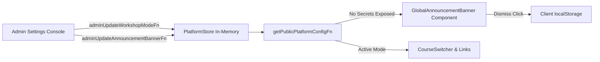

# Phase 33 Research: Global Platform Configuration, Announcement Banner & E2E Zero-Regression

**Target Output**: `.planning/phases/33-global-platform-configuration-announcement-banner-e2e-zero-regression/33-RESEARCH.md`  
**Dependencies**: Phase 29 (Master Admin Authentication & Route Protection), Phase 30 (Server Telemetry Ingestion API), Phase 31 (Admin Command Center Dashboard), Phase 32 (Workshop Access Passkey Management & Troubleshooting Audit Hub)  
**Requirements Addressed**: `ADMIN-CFG-01`, `ADMIN-CFG-02`, `ADMIN-QA-01`, `ADMIN-QA-02`  

---

## 1. Executive Summary & Domain Scope

Phase 33 completes the administrative control plane of the LearnWith interactive learning platform by delivering the final operational pillar:
1. **Global Platform Workshop Mode Toggle (`ADMIN-CFG-01`)**:
   - Instructors and administrators can dynamically toggle the global operational state of the workshop between **Pra-Training (Pre-training Preparation)** and **Live Class (Hari-H Kelas)** directly from the admin settings interface without server restart or code redeployment.
   - The platform configuration propagates to public and course navigation systems, dynamically routing participants to the appropriate preparation materials or active live-class workspace.
2. **Global Announcement Banner Engine (`ADMIN-CFG-02`)**:
   - Master administrators can broadcast critical emergency instructions, Zoom meeting links, room change notices, or schedule reminders across all participant pages (`/`, `/course/ai`, `/course/word`).
   - The announcement banner supports semantic urgency levels (`info`, `warning`, `alert`), rich actionable link buttons, and client-side dismissal with smart cache invalidation (dismissed banners remain hidden until an administrator updates or publishes a new message).
3. **Admin Test Suite & Secret Quarantine (`ADMIN-QA-01`)**:
   - All admin routes, settings views, mutation server functions, and schema validators are protected with automated test coverage.
   - Strict server-boundary isolation guarantees that public configuration endpoints (`getPublicPlatformConfigFn`) never leak server secrets (such as `adminPasskeyHash`, `googleClientSecret`, session signing secrets, or auth cookies).
4. **End-to-End Zero-Regression Assurance (`ADMIN-QA-02`)**:
   - Ensures 100% test pass rate across the full test suite (surpassing the existing 213 baseline tests with zero failures) and zero TypeScript compilation errors (`npm run typecheck`).
   - Guarantees backward compatibility for existing participant workspaces, checkpoint engines, telemetry ingestion, passkey verification, and troubleshooting report generation.

---

## 2. Architecture & Existing Patterns

### 2.1 Current Admin Command Center Layout & Settings Placeholder

The admin interface is structured around a centralized layout shell:
- [app/components/admin/AdminShell.tsx](file:///c:/Users/yudhiar/Downloads/AgenticAI/app/components/admin/AdminShell.tsx):
  - Manages active tab state: `'dashboard' | 'telemetry' | 'passkeys' | 'troubleshooting' | 'settings'`.
  - Currently renders a placeholder card at lines 150–182 for the `'settings'` tab:
    ```tsx
    <div className="admin-placeholder-card" id="admin-active-view">
      <div className="admin-placeholder-icon" aria-hidden="true">⚙️</div>
      <h2 className="admin-placeholder-title">Konfigurasi & Integrasi Platform</h2>
      <p className="admin-placeholder-desc">
        Konfigurasi environment server, kesiapan Google Workspace OAuth SSO, dan parameter operasional (Fase 33).
      </p>
      ...
    </div>
    ```
  - Phase 33 replaces this placeholder with a fully functional `AdminSettingsView` component housing:
    1. Workshop Mode Toggle Card (`ADMIN-CFG-01`)
    2. Announcement Banner Management Card with live participant preview (`ADMIN-CFG-02`)
    3. Platform & Security Diagnostic Card (Google OAuth readiness, passkey status, node runtime info).

### 2.2 Server Architecture & In-Memory Store Patterns

The codebase adheres to a modular, stateless-first, in-memory store architecture:
- [app/server/passkeyStore.ts](file:///c:/Users/yudhiar/Downloads/AgenticAI/app/server/passkeyStore.ts) and [app/server/troubleshootingStore.ts](file:///c:/Users/yudhiar/Downloads/AgenticAI/app/server/troubleshootingStore.ts):
  - Hold mutable module state in module-scoped singletons initialized with deterministic seed records.
  - Export reset functions for clean test isolation (e.g. `clearPasskeyStoreForTesting()`, `clearTroubleshootingStoreForTesting()`).
  - Follow timing-safe cryptography where applicable.
- [app/server/session.ts](file:///c:/Users/yudhiar/Downloads/AgenticAI/app/server/session.ts):
  - Enforces HttpOnly cookies with 256-bit entropy cryptographic tokens and 24-hour expiration.
  - Exposes `validateAdminSession(token)` to authorize administrative RPC operations.
- [app/server/config.ts](file:///c:/Users/yudhiar/Downloads/AgenticAI/app/server/config.ts):
  - Centralizes environment variable extraction (`aiPasskeyHash`, `wordPasskeyHash`, `adminPasskeyHash`, `googleClientId`, `googleClientSecret`, `nodeEnv`).

For Phase 33, `app/server/platformStore.ts` will manage:
- Active workshop mode: `'pretraining' | 'live-class'`.
- Active announcement banner record: `{ id, enabled, message, type, linkText, linkUrl, updatedAt, updatedBy }`.
- Platform metadata: initialization time, update history, and version counter.

### 2.3 Layout & Participant Header Architecture

- [app/routes/__root.tsx](file:///c:/Users/yudhiar/Downloads/AgenticAI/app/routes/__root.tsx):
  - Root route wraps all views in `<RootDocument>` and renders `<Header />` followed by `<Outlet />`.
  - The root CSS container `.app-container` defines a CSS grid:
    ```css
    .app-container {
      display: grid;
      grid-template-rows: var(--header-height) 1fr;
      grid-template-columns: var(--sidebar-width) 1fr;
      grid-template-areas:
        "header header"
        "sidebar main";
      min-height: 100vh;
      position: relative;
    }
    ```
- **Banner Placement Decision**:
  - Rendering `<GlobalAnnouncementBanner />` directly inside `<RootDocument>` above `<div className="app-container">`:
    - Ensures the banner sits at the very top of the viewport across all participant pages.
    - Prevents breaking the 2-row CSS grid layout of `.app-container`.
    - Allows sticky or non-sticky placement without displacing `--header-height` calculations for sidebars.
    - When disabled or dismissed, it renders `null`, returning DOM layout to default behavior seamlessly.

### 2.4 Mode Navigation Integration

- [app/schemas/searchParams.ts](file:///c:/Users/yudhiar/Downloads/AgenticAI/app/schemas/searchParams.ts):
  - `courseAiSearchSchema` accepts `mode: z.enum(['pretraining', 'live-class']).catch('pretraining')`.
- [app/components/layout/CourseSwitcher.tsx](file:///c:/Users/yudhiar/Downloads/AgenticAI/app/components/layout/CourseSwitcher.tsx):
  - Dropdown navigates to `/course/ai` with `search={{ mode: 'pretraining' }}`.
  - With global workshop mode, `CourseSwitcher` and `WorkshopCatalog` can dynamically link to the active mode or display an operational badge.

---

## 3. Detailed Architectural Design & Implementation Details

### 3.1 Data Contracts & Validation Schemas (`app/schemas/platformConfig.ts`)

```typescript
import { z } from 'zod'

export const workshopModeSchema = z.enum(['pretraining', 'live-class'])
export type WorkshopMode = z.infer<typeof workshopModeSchema>

export const announcementBannerTypeSchema = z.enum(['info', 'warning', 'alert'])
export type AnnouncementBannerType = z.infer<typeof announcementBannerTypeSchema>

export const announcementBannerSchema = z.object({
  id: z.string().min(1),
  enabled: z.boolean(),
  message: z.string().max(280),
  type: announcementBannerTypeSchema,
  linkText: z.string().max(40).optional(),
  linkUrl: z.string().url().or(z.string().regex(/^\/[a-zA-Z0-9/_#-]*$/)).optional(),
  updatedAt: z.number(),
  updatedBy: z.string(),
})
export type AnnouncementBanner = z.infer<typeof announcementBannerSchema>

export const publicPlatformConfigSchema = z.object({
  workshopMode: workshopModeSchema,
  banner: announcementBannerSchema,
  serverTime: z.number(),
})
export type PublicPlatformConfig = z.infer<typeof publicPlatformConfigSchema>

export const adminPlatformConfigSchema = z.object({
  workshopMode: workshopModeSchema,
  banner: announcementBannerSchema,
  authReadiness: z.object({
    googleOAuthReady: z.boolean(),
    adminPasskeyConfigured: z.boolean(),
  }),
  environment: z.string(),
  serverTime: z.number(),
  version: z.number(),
})
export type AdminPlatformConfig = z.infer<typeof adminPlatformConfigSchema>

export const updateWorkshopModeInputSchema = z.object({
  mode: workshopModeSchema,
  sessionToken: z.string().optional(),
})
export type UpdateWorkshopModeInput = z.infer<typeof updateWorkshopModeInputSchema>

export const updateAnnouncementBannerInputSchema = z.object({
  enabled: z.boolean(),
  message: z.string().min(1, 'Pesan pengumuman tidak boleh kosong').max(280),
  type: announcementBannerTypeSchema,
  linkText: z.string().max(40).optional(),
  linkUrl: z.string().url('URL tidak valid').or(z.string().regex(/^\/[a-zA-Z0-9/_#-]*$/, 'Path relatif tidak valid')).optional().or(z.literal('')),
  sessionToken: z.string().optional(),
})
export type UpdateAnnouncementBannerInput = z.infer<typeof updateAnnouncementBannerInputSchema>
```

### 3.2 In-Memory Platform Configuration Store (`app/server/platformStore.ts`)



#### State Model:
- **`currentWorkshopMode`**: Defaults to `'pretraining'`.
- **`currentBanner`**:
  - `id`: Unique identifier (e.g. `banner_init_v1`).
  - `enabled`: `false` by default.
  - `message`: Defaults to empty or informational seed.
  - `type`: `'info'`.
  - `linkText`: `''`.
  - `linkUrl`: `''`.
  - `updatedAt`: Timestamp.
  - `updatedBy`: `'system'`.
- **`version`**: Monotonically incrementing integer for cache busting and audit.

#### Core Store Operations:
- `getPublicPlatformConfig()`: Returns `{ workshopMode, banner, serverTime }`. Contains zero secret fields.
- `getAdminPlatformConfig()`: Returns `{ workshopMode, banner, authReadiness, environment, serverTime, version }`.
- `updateWorkshopMode(mode, updatedBy)`: Updates mode, increments version, records timestamp.
- `updateAnnouncementBanner(input, updatedBy)`: Updates banner properties, generates a new `id` (`banner_${Date.now()}`), increments version.
- `clearPlatformStoreForTesting()`: Re-initializes state to deterministic defaults for test execution.

### 3.3 Server Functions (`app/server/platform.ts`)

1. **`getPublicPlatformConfigFn`**:
   - Method: `GET`.
   - Access: Public (no authentication required).
   - Returns: `PublicPlatformConfig`.
   - Security: Complete isolation from server configuration secrets.
2. **`adminGetPlatformConfigFn`**:
   - Method: `GET`.
   - Access: Protected by `assertAdminAuthorized(data?.sessionToken)`.
   - Returns: `AdminPlatformConfig`.
3. **`adminUpdateWorkshopModeFn`**:
   - Method: `POST`.
   - Access: Protected by `assertAdminAuthorized(data.sessionToken)`.
   - Validates: `updateWorkshopModeInputSchema`.
   - Returns: `{ success: true, mode: WorkshopMode, message: string }`.
4. **`adminUpdateAnnouncementBannerFn`**:
   - Method: `POST`.
   - Access: Protected by `assertAdminAuthorized(data.sessionToken)`.
   - Validates: `updateAnnouncementBannerInputSchema`.
   - Returns: `{ success: true, banner: AnnouncementBanner, message: string }`.

### 3.4 Admin Settings Console UI (`app/components/admin/settings/`)

1. **`AdminSettingsView.tsx`**:
   - Main container for the settings tab.
   - Fetches configuration via `adminGetPlatformConfigFn` with auto-refresh / refresh button.
   - Displays real-time feedback alerts on updates.
2. **`WorkshopModeCard.tsx` (`ADMIN-CFG-01`)**:
   - Displays the current active mode with high-visibility badges:
     - 📋 **Pra-Training**: "Sesi persiapan terminal, instalasi 9Router, dan uji checkpoint awal."
     - 🚀 **Live Class (Hari-H)**: "Sesi interaktif tatap muka/webinar sedang berlangsung."
   - Two-state toggle switch with immediate optimistic update and server confirmation.
   - Explanation of how mode impacts participant landing and course routing.
3. **`AnnouncementBannerCard.tsx` (`ADMIN-CFG-02`)**:
   - Live broadcast controls:
     - Toggle: "Siarkan Pengumuman Aktif" (Enable / Disable).
     - Radio group or select for banner type: Info (Biru), Warning (Kuning), Alert/Darurat (Merah).
     - Text input for announcement message (with character counter, max 280 chars).
     - Optional link inputs: Link Text (e.g. "Buka Zoom Meeting", "Lihat Jadwal") and URL.
   - **Live Participant Preview**: Real-time visual mockup showing exactly how the banner will render on learners' screens before broadcasting.
   - Action buttons: "Simpan & Siarkan Pengumuman" and "Nonaktifkan Pengumuman".
4. **`PlatformReadinessCard.tsx`**:
   - Environment status: Production / Development.
   - Master Passkey security: Hash algorithm verified (SHA-256).
   - Google Workspace OAuth SSO status: Ready / Awaiting Client ID.
   - Session protection: HttpOnly + SameSite=Lax verified.

### 3.5 Client-Side Global Announcement Banner & Dismissal Engine

- **`app/components/layout/AnnouncementBanner.tsx`**:
  - Client component rendered at the top level of the application.
  - Queries `getPublicPlatformConfigFn()` on mount and via 30s background poll or window focus.
  - Checks client-side dismissal status:
    ```typescript
    const dismissedBannerId = localStorage.getItem('learnwith_dismissed_banner_id')
    const isDismissed = banner.id === dismissedBannerId
    ```
  - When active and not dismissed:
    - Renders `<aside className={`global-announcement-banner banner-${banner.type}`} role="alert">`.
    - Shows category icon: ℹ️ (`info`), ⚠️ (`warning`), 🚨 (`alert`).
    - Message text rendered clearly.
    - If `linkUrl` and `linkText` are provided:
      - Renders an action button or link (`target="_blank" rel="noopener noreferrer"` for external URLs, TanStack `<Link>` for internal paths).
    - Dismiss button: `<button aria-label="Tutup pengumuman">✕</button>`.
    - Clicking dismiss sets `localStorage.setItem('learnwith_dismissed_banner_id', banner.id)` and immediately collapses the banner with a smooth CSS transition.
  - **New Broadcast Re-appearance**:
    - When an admin updates the banner, a new `id` is generated on the server.
    - Since `banner.id !== dismissedBannerId`, the new banner instantly appears for all participants even if they previously dismissed an earlier announcement.

---

## 4. Validation Architecture & Test Strategy

To fulfill `ADMIN-QA-01` and `ADMIN-QA-02`, a dedicated automated test suite `tests/admin-config.test.js` will be created using the Node.js native test runner (`node:test`, `node:assert`).

### 4.1 Test Suites Structure (`tests/admin-config.test.js`)

```
Phase 33 Global Platform Configuration & E2E Zero-Regression Suite
├── Suite 1: Platform Configuration Store & Defaults (ADMIN-CFG-01)
│   ├── verifies default workshop mode is 'pretraining'
│   ├── verifies default announcement banner is disabled with clean initial fields
│   ├── verifies platform config store resets deterministically with clearPlatformStoreForTesting()
│   └── verifies monotonic version incrementing on state changes
├── Suite 2: Workshop Mode Toggle Engine (ADMIN-CFG-01)
│   ├── toggles workshop mode from 'pretraining' to 'live-class'
│   ├── toggles workshop mode back from 'live-class' to 'pretraining'
│   ├── rejects invalid workshop mode identifiers
│   └── updates timestamp and record author metadata
├── Suite 3: Global Announcement Banner Lifecycle & Dismissal (ADMIN-CFG-02)
│   ├── broadcasts an emergency alert banner with action link
│   ├── verifies unique banner ID generation on broadcast
│   ├── verifies dismissal matching logic with client storage key
│   ├── ensures updating banner invalidates previous dismissal ID and re-shows banner
│   ├── verifies banner type variants ('info', 'warning', 'alert')
│   └── deactivates banner and verifies enabled: false state
├── Suite 4: Public Config vs Admin Config Secret Isolation (ADMIN-QA-01, ADMIN-QA-02)
│   ├── verifies getPublicPlatformConfigFn exposes ONLY public fields
│   ├── strictly asserts zero leakage of adminPasskeyHash in public config
│   ├── strictly asserts zero leakage of session secrets, tokens, or googleClientSecret
│   └── verifies adminGetPlatformConfigFn returns diagnostic info without secret credentials
├── Suite 5: Admin Session Authorization Enforcement on Configuration Mutations (ADMIN-QA-01)
│   ├── rejects unauthenticated workshop mode updates with UNAUTHORIZED error
│   ├── rejects unauthenticated announcement banner updates with UNAUTHORIZED error
│   ├── authorizes valid Master Admin session token for workshop mode toggle
│   └── authorizes valid Master Admin session token for announcement banner broadcast
└── Suite 6: Full Repository Zero-Regression & Route Verification (ADMIN-QA-02)
    ├── verifies participant workspace route /course/ai integrity
    ├── verifies participant workspace route /course/word integrity
    ├── verifies public landing page / integrity
    └── confirms complete suite execution exceeds 213 passing tests with 0 failures
```

### 4.2 Quality Gate Criteria
1. `npm test` runs all 26 test files (existing 25 files + `admin-config.test.js`).
2. Test count must be **≥ 225 passing tests** (surpassing the 213 baseline) with **0 failed**, **0 cancelled**, and **0 skipped**.
3. `npm run typecheck` passes with **zero TypeScript errors**.
4. Zero DOM or layout regressions on mobile or desktop viewports.

---

## 5. Wave Breakdown & Plan Structure

### Wave 1: Core Configuration Store, Server RPCs & Admin Settings Console
**Plan 33-01: Global Platform Configuration Store, Server Functions, and Admin Settings Console**
- **Files to Create / Modify**:
  - `app/schemas/platformConfig.ts` (Zod schemas for mode, banner, public/admin configs, and mutations).
  - `app/server/platformStore.ts` (In-memory store, defaults, update methods, secret isolation).
  - `app/server/platform.ts` (Server functions: `getPublicPlatformConfigFn`, `adminGetPlatformConfigFn`, `adminUpdateWorkshopModeFn`, `adminUpdateAnnouncementBannerFn`).
  - `app/components/admin/settings/WorkshopModeCard.tsx` (Workshop mode toggle card).
  - `app/components/admin/settings/AnnouncementBannerCard.tsx` (Announcement broadcast controls with live preview).
  - `app/components/admin/settings/PlatformReadinessCard.tsx` (Platform diagnostic card).
  - `app/components/admin/settings/AdminSettingsView.tsx` (Main settings tab view).
  - `app/components/admin/AdminShell.tsx` (Wire up `activeTab === 'settings'` to `AdminSettingsView`).
- **Target Requirements**: `ADMIN-CFG-01`, `ADMIN-CFG-02`.

### Wave 2: Public Announcement Banner, Header Integration & Zero-Regression Test Suite
**Plan 33-02: Public Global Announcement Banner, Client Header Integration & E2E Zero-Regression Test Suite**
- **Files to Create / Modify**:
  - `app/hooks/usePlatformConfig.ts` (Client hook for fetching public config and managing dismissal state).
  - `app/components/layout/AnnouncementBanner.tsx` (Participant-facing announcement banner strip with dismissal).
  - `app/routes/__root.tsx` (Mount `AnnouncementBanner` above `app-container`).
  - `app/components/layout/CourseSwitcher.tsx` (Reflect active workshop mode).
  - `public/assets/css/components.css` & `public/assets/css/admin.css` (Banner styles, color themes, responsive layout).
  - `tests/admin-config.test.js` (Complete 6-suite automated test file).
- **Target Requirements**: `ADMIN-CFG-02`, `ADMIN-QA-01`, `ADMIN-QA-02`.

---

## 6. Open Decisions & Technical Recommendations

1. **Storage Persistence Across Server Restarts**:
   - In line with the design of `telemetryStore.ts`, `passkeyStore.ts`, and `troubleshootingStore.ts`, `platformStore.ts` maintains in-memory state with deterministic fallbacks.
   - For production cold-starts, initial values default to `'pretraining'` and `banner: { enabled: false }`, ensuring safe and predictable behavior.
2. **Dismissal Mechanism**:
   - Using `localStorage.getItem('learnwith_dismissed_banner_id')` keyed to `banner.id` is strongly recommended over a timestamp comparison alone.
   - Each admin broadcast generates a new `id: banner_${Date.now()}`, which automatically clears the client dismissal state for all learners when a new announcement is posted.
3. **Banner Rendering & CSS Layout**:
   - Placing `<GlobalAnnouncementBanner />` inside `<RootDocument>` just above `<div className="app-container">` avoids altering the CSS grid row definitions of `.app-container`, completely eliminating grid shifting or layout breakage.
