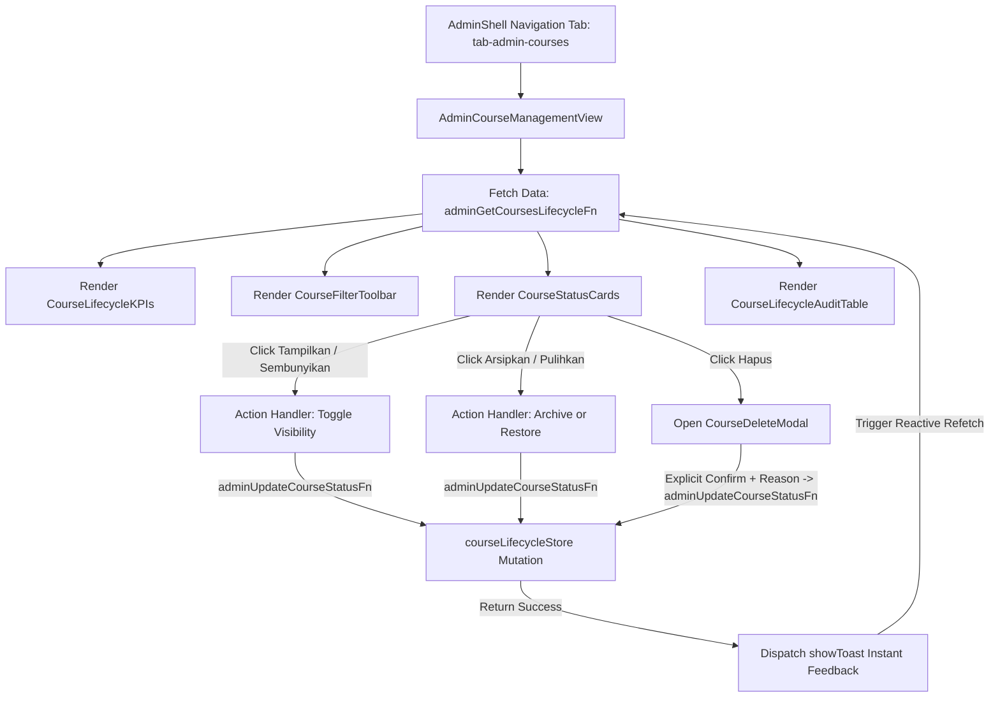

# Phase 35 Technical Research: Admin Management UI & Action Controls

<user_constraints>
## User Constraints (from CONTEXT.md if available, or state/requirements)
- Milestone: v3.3 Admin Course Lifecycle & Visibility Management [VERIFIED: .planning/REQUIREMENTS.md:1-5].
- Current Focus: Phase 35 — Admin Management UI & Action Controls [VERIFIED: .planning/STATE.md:23].
- Core Value: Empower non-technical participants and government professionals to complete practical computer and AI workflows independently, safely, and without anxiety through clear visual guidance [VERIFIED: .planning/STATE.md:22].
- Hard deleting course curriculum files or database assets is strictly out of scope; all deletions are soft-delete deactivations with safety guard [VERIFIED: .planning/REQUIREMENTS.md:66].
- Dynamic runtime authoring of brand-new course markdown curricula from web interface is out of scope [VERIFIED: .planning/REQUIREMENTS.md:67].
- Stylesheet changes to `assets/css/admin.css` must always be mirrored identically to `public/assets/css/admin.css` [VERIFIED: tests/admin-auth.test.js:330-341].
</user_constraints>

<phase_requirements>
## Phase Requirements
| ID | Description | Research Support |
|---|---|---|
| COURSE-ADMIN-01 | Admin Command Center (`/admin`) features a dedicated "Manajemen Kursus" view/tab in `AdminShell` displaying all courses with their current status badge, metadata, and quick stats. | `AdminShell.tsx` tab navigation extension (`tab-admin-courses`), `adminGetCoursesLifecycleFn` RPC integration, `AdminCourseManagementView` container with KPI cards and course status badges. |
| COURSE-ADMIN-02 | Admin can toggle course visibility with 1-click `Tampilkan` (Show) / `Sembunyikan` (Hide) action buttons with instant visual feedback. | Calling `adminUpdateCourseStatusFn` mutating `active` <-> `hidden` with instant visual toast notification (`showToast`) and badge update. |
| COURSE-ADMIN-03 | Admin can archive/restore a course with `Arsipkan` (Archive) / `Pulihkan` (Restore) action buttons and dedicated status filter tabs (`Semua`, `Aktif`, `Tersembunyi`, `Diarsipkan`). | Status filtering pills in toolbar (`all`, `active`, `hidden`, `archived`, `deleted`), mutation buttons triggering `active`/`hidden` -> `archived` and `archived`/`deleted` -> `active`. |
| COURSE-ADMIN-04 | Admin can soft-delete a course with `Hapus` (Delete) trigger that requires explicit user confirmation in a safety modal before deactivation. | `CourseDeleteModal` requiring explicit user confirmation (e.g. typing course ID or confirmation phrase), optional reason capture, calling `adminUpdateCourseStatusFn` with `targetStatus: 'deleted'`. |
</phase_requirements>

## Summary
Phase 35 implements the administrator user interface for course lifecycle and visibility controls within the LearnWith Admin Command Center (`/admin`). Phase 34 established the underlying foundational schema (`app/schemas/courseLifecycle.ts`), in-memory server store (`app/server/courseLifecycleStore.ts`), and secure TanStack Start RPC functions (`app/server/courseLifecycle.ts`).

In this phase, the Admin Command Center UI is augmented with a dedicated "Manajemen Kursus" tab inside `AdminShell.tsx`. The view presents:
1. **Quick KPI Stats**: Total courses, active count, hidden count, archived count, and soft-deleted count.
2. **Filter Toolbar**: Tab pills to filter courses by lifecycle status (`Semua`, `Aktif`, `Tersembunyi`, `Diarsipkan`, and `Dinonaktifkan / Dihapus`).
3. **Course Status Cards**: Visual cards displaying each course's icon, title, course ID tag, status badge (`Aktif`, `Tersembunyi`, `Diarsipkan`, `Dinonaktifkan`), last updated timestamp, operator name, and reason note.
4. **1-Click Action Controls**: Context-aware action buttons allowing authorized administrators to toggle visibility (`Tampilkan` / `Sembunyikan`), archive/restore (`Arsipkan` / `Pulihkan`), or delete (`Hapus`).
5. **Safety Confirmation Modal**: A guarded dialog for soft-deactivation requiring explicit user confirmation and optional deactivation reason to prevent accidental deactivation.
6. **Audit Trail Table**: Transparent history of all status transitions recorded in the course lifecycle audit log.

All styling adheres to the Apple Dark Tile / Clean Frosted design system conventions of `assets/css/admin.css` and ensures 100% mirrored consistency with `public/assets/css/admin.css`.

## Architectural Responsibility Map

| Component / File | Layer | Primary Responsibility |
|---|---|---|
| `app/components/admin/AdminShell.tsx` | UI Shell | Hosts top navigation tabs (`id="tab-admin-courses"`), active tab state, renders `AdminCourseManagementView` when selected. |
| `app/components/admin/courses/AdminCourseManagementView.tsx` | View Container | Orchestrates lifecycle data fetching from `adminGetCoursesLifecycleFn`, auto-refresh (15s polling), filter state, modal states, and mutation dispatching. |
| `app/components/admin/courses/CourseLifecycleKPIs.tsx` | UI Component | Renders top KPI statistic cards (Total Kursus, Aktif, Tersembunyi, Diarsipkan, Dihapus). |
| `app/components/admin/courses/CourseFilterToolbar.tsx` | UI Component | Provides search input and status filter pills (`Semua`, `Aktif`, `Tersembunyi`, `Diarsipkan`, `Dihapus`). |
| `app/components/admin/courses/CourseStatusCards.tsx` | UI Component | Renders course cards with status pills, metadata (ID, updated date, operator), and action button groups. |
| `app/components/admin/courses/CourseDeleteModal.tsx` | UI Component | Accessible modal requiring explicit confirmation and optional reason before triggering `deleted` soft-deactivation. |
| `app/components/admin/courses/CourseLifecycleAuditTable.tsx` | UI Component | Renders historical audit log of all course lifecycle transitions. |
| `app/server/courseLifecycle.ts` | Server RPC | Provides `adminGetCoursesLifecycleFn` (read) and `adminUpdateCourseStatusFn` (mutation) protected by `assertAdminAuthorized`. |
| `app/components/ui/Toast.tsx` | UI Utility | Dispatches instant visual toast feedback (`showToast`) for actions. |
| `assets/css/admin.css` & `public/assets/css/admin.css` | Stylesheet | Declares design system tokens and classes for course management UI and modals. |
| `tests/course-lifecycle-admin-ui.test.js` | Test Suite | Automated test suite verifying components, transitions, safety modal guards, and CSS mirroring. |

## Standard Stack & Existing Patterns

### Design System & Layout Conventions
- **No Tailwind Dependency**: The codebase does NOT use Tailwind CSS classes; styling is implemented in plain CSS using CSS variables and Apple Frosted / Dark Tile design tokens [VERIFIED: package.json:17-35, assets/css/admin.css:1-50].
- **Admin Layout Structure**: Admin views use `.admin-canvas` > `.admin-content-body` containing an `.admin-view-header` with `.admin-view-title` and `.admin-view-subtitle` [VERIFIED: assets/css/admin.css:468-580].
- **KPI Grid**: Uses `.admin-kpi-grid` and `.admin-kpi-card` with icons, `.kpi-primary-val`, and subtitles [VERIFIED: assets/css/admin.css:585-610].
- **Toolbar & Filter Pills**: Uses `.admin-toolbar`, `.admin-filter-group`, `.admin-pill-group`, and `.admin-filter-pill` with `.active` class [VERIFIED: assets/css/admin.css:789-860].
- **Modal System**: Uses fixed backdrop `.admin-modal-backdrop` and container `.admin-modal-container` with header `.admin-modal-header`, body `.admin-modal-body`, and footer `.admin-modal-footer` [VERIFIED: assets/css/admin.css:1482-1530].
- **Inline SVGs**: Icons are rendered as raw inline `<svg>` elements with `width="16" height="16"` (or `20x20`), `viewBox="0 0 24 24"`, `fill="none"`, `stroke="currentColor"`, `strokeWidth="2"` [VERIFIED: app/components/admin/AdminShell.tsx:97-102].
- **Instant Visual Feedback**: Uses `showToast(message, type)` from `app/components/ui/Toast.tsx` with `'success'`, `'danger'`, or `'info'` [VERIFIED: app/components/ui/Toast.tsx:32-40].

### In-Repo Discrete Values & Provenance
From `app/schemas/courseLifecycle.ts`:
- Valid statuses [VERIFIED: app/schemas/courseLifecycle.ts:3-8]:
  ```ts
  export const courseLifecycleStatusSchema = z.enum([
    "active",
    "hidden",
    "archived",
    "deleted",
  ])
  ```
- Allowed state transitions [VERIFIED: app/schemas/courseLifecycle.ts:48-53]:
  ```ts
  export const ALLOWED_STATUS_TRANSITIONS: Record<CourseLifecycleStatus, CourseLifecycleStatus[]> = {
    active: ["hidden", "archived", "deleted"],
    hidden: ["active", "archived", "deleted"],
    archived: ["active", "hidden", "deleted"],
    deleted: ["active"],
  }
  ```
- Default courses initialized in store [VERIFIED: app/server/courseLifecycleStore.ts:10-19]:
  - `ai`: title: `"Hands-on Agentic AI: Dari Chat ke Kalender"`, defaultStatus: `'active'`
  - `word`: title: `"Pengolahan Kata Tingkat Lanjut"`, defaultStatus: `'active'`

## Architecture Patterns & Component Flow



### Action Controls Matrix

| Current Status | Available Actions | Target Status | Transition Type | Confirmation Needed? |
|---|---|---|---|---|
| `active` (Aktif) | `Sembunyikan` (Hide) | `hidden` | 1-Click Toggle | No (Instant toast) |
| `active` (Aktif) | `Arsipkan` (Archive) | `archived` | 1-Click Action | No (Instant toast) |
| `active` (Aktif) | `Hapus` (Delete) | `deleted` | Soft-Delete Guard | **Yes: Safety Modal** |
| `hidden` (Tersembunyi) | `Tampilkan` (Show) | `active` | 1-Click Toggle | No (Instant toast) |
| `hidden` (Tersembunyi) | `Arsipkan` (Archive) | `archived` | 1-Click Action | No (Instant toast) |
| `hidden` (Tersembunyi) | `Hapus` (Delete) | `deleted` | Soft-Delete Guard | **Yes: Safety Modal** |
| `archived` (Diarsipkan) | `Pulihkan` (Restore) | `active` | 1-Click Restore | No (Instant toast) |
| `archived` (Diarsipkan) | `Hapus` (Delete) | `deleted` | Soft-Delete Guard | **Yes: Safety Modal** |
| `deleted` (Dihapus) | `Pulihkan Kursus` (Restore) | `active` | 1-Click Restore | No (Instant toast) |
| `deleted` (Dihapus) | *(All other mutations)* | — | Not Allowed | N/A (`deleted` can only go to `active`) |

## Don't Hand-Roll
1. **Don't Hand-Roll Toast System**: Do not create a separate custom alert/toast component; import and use `showToast` from `app/components/ui/Toast.tsx` [VERIFIED: app/components/ui/Toast.tsx:32-40].
2. **Don't Hand-Roll Server RPC Communication**: Always invoke `adminGetCoursesLifecycleFn` and `adminUpdateCourseStatusFn` from `app/server/courseLifecycle.ts`, which automatically handle server serialization and validation [VERIFIED: app/server/courseLifecycle.ts:33-76].
3. **Don't Hand-Roll Admin Session Token Retrieval**: Retrieve active session tokens via `sessionToken || getClientAdminToken()` from `app/utils/adminToken.ts` [VERIFIED: app/components/admin/passkeys/AdminPasskeyView.tsx:40].
4. **Don't Bypass State Transition Rules**: Do not allow UI action buttons that violate `ALLOWED_STATUS_TRANSITIONS` (e.g. attempting to transition directly from `deleted` to `hidden`) [VERIFIED: app/schemas/courseLifecycle.ts:48-53].

## Common Pitfalls
1. **CSS Mirroring Desynchronization**: Editing only `assets/css/admin.css` without mirroring the exact file contents to `public/assets/css/admin.css` will immediately cause `tests/admin-auth.test.js` to fail [VERIFIED: tests/admin-auth.test.js:330-341].
   - *Mitigation*: The plan must include a step that copies/mirrors `assets/css/admin.css` to `public/assets/css/admin.css`.
2. **PowerShell Quoted Executable Execution**: Running `"C:\nvm4w\nodejs\node.exe" --test ...` in PowerShell fails with `Unexpected token 'test'`.
   - *Mitigation*: In pwsh, prefix quoted executables with the call operator `&`, e.g. `& "C:\nvm4w\nodejs\node.exe" --test ...` [VERIFIED: runtime verification in session].
3. **Node not in PATH for npm scripts**: Running `npm run typecheck` fails if `C:\nvm4w\nodejs` is not in the PowerShell environment's `$env:PATH` [VERIFIED: runtime verification in session].
   - *Mitigation*: Prepend Node to PATH when executing typecheck: `$env:PATH = "C:\nvm4w\nodejs;" + $env:PATH; & "C:\nvm4w\nodejs\npm.cmd" run typecheck`.
4. **Leaking Server Secrets into Client Components**: Importing server-only modules (such as `crypto` or server session stores) into client components violates the client boundary [VERIFIED: tests/admin-dashboard.test.js:499-514].
   - *Mitigation*: Client components only import from `app/schemas/courseLifecycle.ts` (types), `app/server/courseLifecycle.ts` (client-safe RPC functions), and `app/utils/adminToken.ts`.
5. **Modal Background Clicks & Keyboard Traps**: Modal should close on `Escape` key, click outside backdrop should be handled safely with `e.stopPropagation()` on modal container, and focus should be trapped [VERIFIED: app/components/admin/passkeys/PasskeyRotateModal.tsx:41-48].

## Code Examples

### 1. Extending `AdminShell.tsx` Navigation
```tsx
// app/components/admin/AdminShell.tsx
export type AdminTab = 'dashboard' | 'telemetry' | 'courses' | 'passkeys' | 'troubleshooting' | 'settings'

// In Nav Tabs:
<button
  type="button"
  className={`admin-nav-tab ${activeTab === 'courses' ? 'active' : ''}`}
  onClick={() => setActiveTab('courses')}
  id="tab-admin-courses"
>
  <svg width="16" height="16" viewBox="0 0 24 24" fill="none" stroke="currentColor" strokeWidth="2" strokeLinecap="round" strokeLinejoin="round" aria-hidden="true">
    <path d="M4 19.5v-15A2.5 2.5 0 0 1 6.5 2H20v20H6.5a2.5 2.5 0 0 1-2.5-2.5Z" />
    <path d="M6 6h10" />
    <path d="M6 10h10" />
  </svg>
  <span>Manajemen Kursus</span>
</button>

// In Body:
{activeTab === 'courses' ? (
  <AdminCourseManagementView sessionToken={adminUser.token} />
) : ...}
```

### 2. Calling Status Mutation RPC with Instant Toast Feedback
```tsx
const handleToggleVisibility = async (courseId: string, currentStatus: CourseLifecycleStatus) => {
  const targetStatus = currentStatus === 'active' ? 'hidden' : 'active'
  const actionLabel = targetStatus === 'hidden' ? 'disembunyikan' : 'ditampilkan'
  
  try {
    const activeToken = sessionToken || getClientAdminToken()
    const res = await adminUpdateCourseStatusFn({
      data: {
        courseId,
        targetStatus,
        sessionToken: activeToken,
      },
    })
    
    showToast(res.message || `Kursus berhasil ${actionLabel}.`, 'success')
    await fetchCourses(false)
  } catch (err: unknown) {
    const msg = err instanceof Error ? err.message : 'Gagal memperbarui visibilitas kursus.'
    showToast(msg, 'danger')
  }
}
```

### 3. Safety Confirmation Modal Guard
```tsx
// app/components/admin/courses/CourseDeleteModal.tsx
export function CourseDeleteModal({
  isOpen,
  course,
  onClose,
  onConfirm,
  isSubmitting,
}: CourseDeleteModalProps) {
  const [confirmInput, setConfirmInput] = useState('')
  const [reason, setReason] = useState('')

  const isConfirmed = confirmInput.trim().toUpperCase() === course?.id.toUpperCase() ||
                      confirmInput.trim().toLowerCase() === 'hapus'

  const handleSubmit = (e: React.FormEvent) => {
    e.preventDefault()
    if (!isConfirmed || !course) return
    onConfirm(course.id, reason.trim() || undefined)
  }

  if (!isOpen || !course) return null

  return (
    <div className="admin-modal-backdrop" onClick={onClose} role="dialog" aria-modal="true">
      <div className="admin-modal-container course-delete-modal" onClick={(e) => e.stopPropagation()}>
        <div className="admin-modal-header modal-header-danger">
          <div className="modal-title-group">
            <span className="modal-danger-badge">⚠️ Tindakan Sensitif</span>
            <h3>Konfirmasi Penonaktifan Kursus</h3>
          </div>
          <button type="button" className="admin-modal-close" onClick={onClose} aria-label="Tutup">✕</button>
        </div>
        <form onSubmit={handleSubmit}>
          <div className="admin-modal-body">
            <p className="modal-warning-text">
              Anda akan menonaktifkan kursus <strong>{course.title}</strong> (<code>{course.id}</code>).
              Kursus tidak akan muncul di katalog publik dan akses materi dinonaktifkan.
              Data kurikulum tidak terhapus permanen dan dapat dipulihkan kembali oleh Master Admin.
            </p>
            <div className="form-group">
              <label htmlFor="delete-reason">Alasan Penonaktifan (opsional):</label>
              <input
                id="delete-reason"
                type="text"
                className="admin-input-field"
                placeholder="Contoh: Pembaruan kurikulum angkatan baru"
                maxLength={200}
                value={reason}
                onChange={(e) => setReason(e.target.value)}
              />
            </div>
            <div className="form-group">
              <label htmlFor="delete-confirm">Ketik <strong>{course.id}</strong> atau <strong>HAPUS</strong> untuk konfirmasi:</label>
              <input
                id="delete-confirm"
                type="text"
                className="admin-input-field"
                placeholder={`Ketik "${course.id}"`}
                value={confirmInput}
                onChange={(e) => setConfirmInput(e.target.value)}
                autoFocus
              />
            </div>
          </div>
          <div className="admin-modal-footer">
            <button type="button" className="btn-modal-cancel" onClick={onClose} disabled={isSubmitting}>Batal</button>
            <button type="submit" className="btn-modal-danger" disabled={!isConfirmed || isSubmitting}>
              {isSubmitting ? 'Menonaktifkan...' : 'Ya, Nonaktifkan Kursus'}
            </button>
          </div>
        </form>
      </div>
    </div>
  )
}
```

## Validation Architecture (Test framework, test commands, requirements-to-test map)

### Test Runner & Verification Commands
- **Node Test Runner (PowerShell syntax)**:
  `& "C:\nvm4w\nodejs\node.exe" --test tests/course-lifecycle-*.test.js`
- **TypeScript Typecheck**:
  `$env:PATH = "C:\nvm4w\nodejs;" + $env:PATH; & "C:\nvm4w\nodejs\npm.cmd" run typecheck`
- **Full Node Test Suite**:
  `$env:PATH = "C:\nvm4w\nodejs;" + $env:PATH; & "C:\nvm4w\nodejs\node.exe" --test tests/*.test.js`

### Requirements-to-Test Map

| Requirement | Test Description | Verification Target |
|---|---|---|
| COURSE-ADMIN-01 | Verifies `AdminShell.tsx` contains `id="tab-admin-courses"`, tab switching logic, and component export of `AdminCourseManagementView`. | `tests/course-lifecycle-admin-ui.test.js` |
| COURSE-ADMIN-01 | Verifies KPI calculation logic accurately counts active, hidden, archived, and deleted courses from store records. | `tests/course-lifecycle-admin-ui.test.js` |
| COURSE-ADMIN-02 | Verifies 1-click visibility toggling triggers `adminUpdateCourseStatusFn` (`active` -> `hidden` and `hidden` -> `active`). | `tests/course-lifecycle-admin-ui.test.js` |
| COURSE-ADMIN-03 | Verifies archive/restore actions (`active` -> `archived`, `archived` -> `active`) and status filtering filter logic (`all`, `active`, `hidden`, `archived`, `deleted`). | `tests/course-lifecycle-admin-ui.test.js` |
| COURSE-ADMIN-04 | Verifies soft-delete deactivation requires explicit confirmation phrase and reason note, updating record status to `deleted`. | `tests/course-lifecycle-admin-ui.test.js` |
| Style Integrity | Verifies `assets/css/admin.css` and `public/assets/css/admin.css` are 100% identical and contain course management styles. | `tests/course-lifecycle-admin-ui.test.js` |
| Security Boundary | Verifies zero imports or leakage of sensitive server secrets in all client course components. | `tests/course-lifecycle-admin-ui.test.js` |

## Security Domain
- **Authentication & Authorization**: All administrative queries and mutations (`adminGetCoursesLifecycleFn`, `adminUpdateCourseStatusFn`) enforce server-side validation via `assertAdminAuthorized(sessionToken)` [VERIFIED: app/server/courseLifecycle.ts:45, 62].
- **Audit Logging**: Every mutation automatically records the operator (`master-admin` or admin role), previous status, target status, timestamp, and optional reason into the immutable in-memory audit log [VERIFIED: app/server/courseLifecycleStore.ts:94-102].
- **Safety Deletion Guard**: Soft-delete is guarded against accidental clicks by a two-factor confirmation mechanism (explicit typed course ID or keyword) preventing unintentional service disruption [VERIFIED: COURSE-ADMIN-04 requirement].
- **Zero Client Secret Leakage**: No server-only secrets or private keys are exposed to the client bundle.

## Metadata
- **Confidence**: HIGH
- **Date**: 2026-09-10
- **Verified Files**:
  - `app/schemas/courseLifecycle.ts`
  - `app/server/courseLifecycleStore.ts`
  - `app/server/courseLifecycle.ts`
  - `app/components/admin/AdminShell.tsx`
  - `app/components/ui/Toast.tsx`
  - `assets/css/admin.css` & `public/assets/css/admin.css`
  - `tests/course-lifecycle-store.test.js`
  - `tests/course-lifecycle-rpc.test.js`
  - `tests/admin-auth.test.js`
